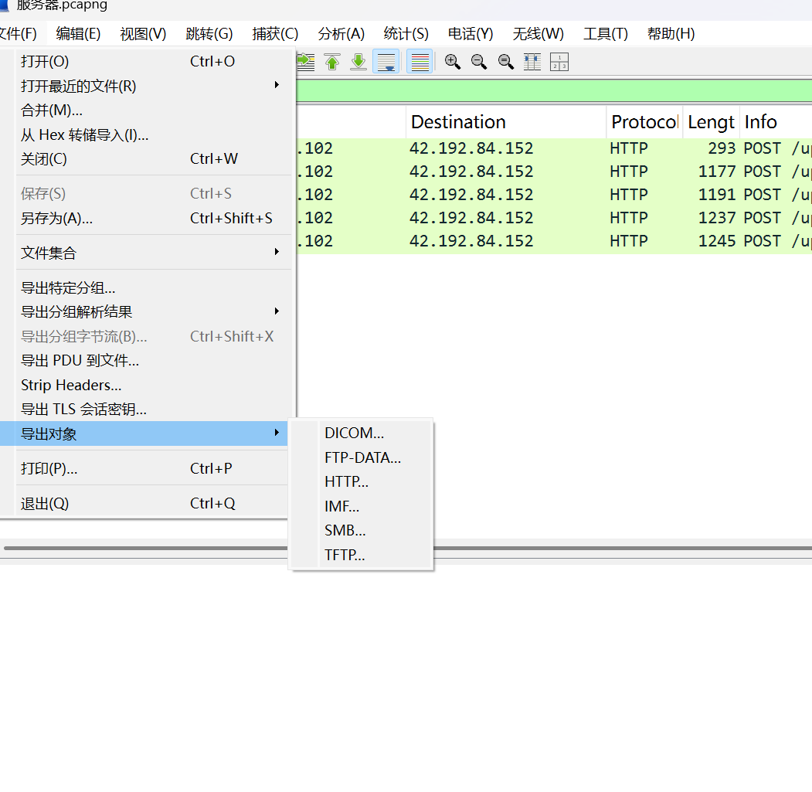

# 陇剑杯2021-wifi

## 题目描述

下载后得到三个文件：`客户端.pcap`、`服务端.pcap`、`memdump.mem`。

## 分析 客户端.pcap
首先点击进入 `客户端.pcap` 查看。

一片白，这代表 802.11 流量加密了底层的数据，Wireshark 无法分辨出包内的协议。但我们可以发现 WiFi 的 SSID 为 `My_Wifi`。根据题目提示，我们去内存镜像中查找。

## 分析内存镜像 (memdump.mem) - 寻找线索

运行 `filescan` 找到压缩包，但提取解压时却显示需要密码。

再根据题目提示，我们在内存镜像中查找密码（可以使用 `strings` 命令或 Volatility 的 `strings` 插件）。

有很多疑似密码的字符串，我们找几个有嫌疑的试试，结果第二个 (`Ljbei_@#_666`) 就是压缩包密码。

## 获取 WiFi 密码
解压后得到 WiFi 密码文件。

## 解密 WiFi 流量并分析
现在用得到的密码和SSID在 Wireshark 中解密 `客户端.pcap` 流量。
（Wireshark -> 编辑 -> 首选项 -> Protocols -> IEEE 802.11 -> Decryption Keys -> 新增 WPA-PWD）

解密后，我们看一下协议分级（统计 -> 协议分级）。`TCP` 流量最多，再结合题目提示的 `upload-labs`，开始追踪 `TCP` 流。

追踪流时不要傻乎乎地一个个连接地查看，我们可以找到第一个 `HTTP` 响应开始的位置，然后开始查看追踪流。

最后在第 38 个 TCP 连接的地方找到了加密数据。

结合在第 33 个 TCP 连接处能发现客户端已经进入了上传页面，很容易就能判断出这些数据是哥斯拉（Godzilla）加密的 webshell 流量。因此我们再去 `服务端.pcap` 查看。

## 分析 服务端.pcap - 寻找 Webshell
服务端的流量很少，有几个扎眼的 `POST` 请求流量。我们过滤一下 (使用过滤表达式 `http.request.method == "POST"`)，直接提取 HTTP 对象（文件 -> 导出对象 -> HTTP）。

HTTP 流量提取出来，找到木马文件（通常是上传的 PHP 文件）。

## 解码 Webshell 获取解密逻辑
提取出的 Webshell 代码如下：

随便找个在线的 PHP 解释器或本地环境，解码木马，得到解密代码/密钥。可知数据部分通常经过 `base64` 编码和 `gzdecode` 压缩。

## 提取加密数据并解密
接着我们导出 `客户端.pcap` 中 TCP 流 38 的加密数据。

可以看到加密数据里的 Base64 格式不对，其中还有 `fL1t` 的字样。根据哥斯拉流量特征，我们去掉头尾各 16 位多出来的字符。然后尝试使用之前找到的密钥和解密逻辑（结合 `gzdecode` 解压缩）来解密。

## 获取 Flag
解密后得到 flag。
