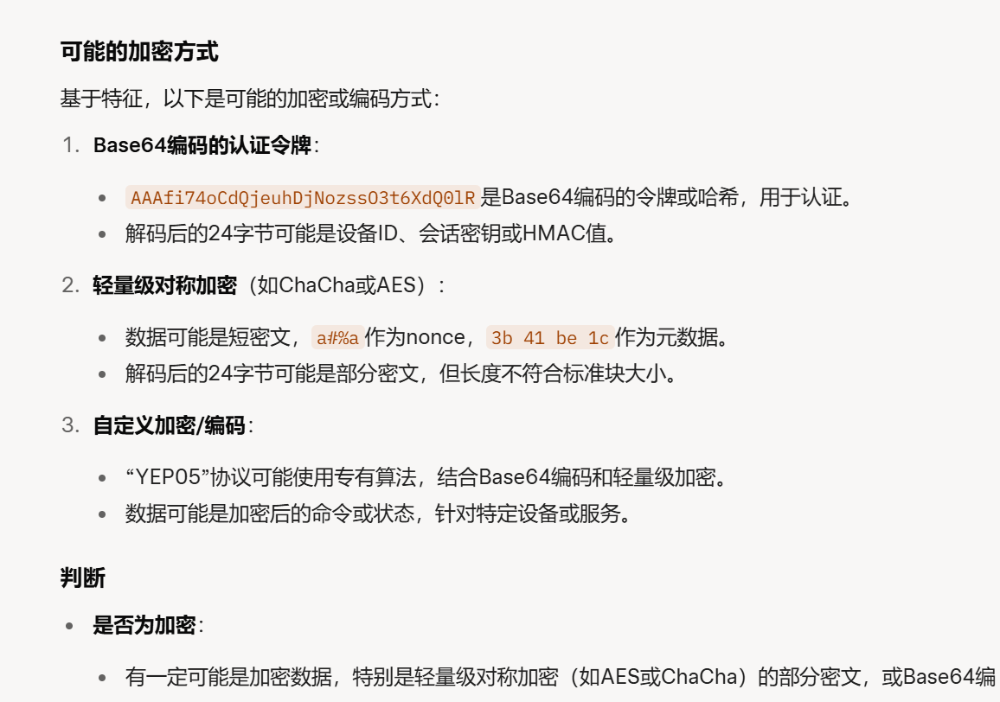

# 陇剑杯2021 - 流量分析 Writeup

## 1. 静态分析 (IDA)

首先，对提供的相关可执行文件进行静态分析。

*   在 IDA Pro 中加载程序，使用 "Strings" 视图 (Shift+F12) 查找可疑字符串。
*   发现 `Login Successful!` 字符串，暗示程序可能包含认证或登录逻辑。
    
*   双击 `Login Successful!` 跳转到其在代码中的引用位置。分析上下文，注意到附近存在 `P05=` 字符串。这看起来像一个自定义协议的标识符或魔术字 (Magic Number)。
    

## 2. Pcap 包初步分析

接下来，分析提供的 `.pcap` 流量包。

*   使用 Wireshark 打开 `pcap` 文件。
*   观察到多个数据包（特别是 UDP 包）的 Data 段（Payload）以 `P05=` 开头。
    
*   结合 IDA 中发现的 `Login Successful!` 和 `P05=`，可以推断这是一种自定义的应用层协议，`P05=` 是其标识，并且可能涉及认证过程。数据部分看起来杂乱，有加密的可能性。

## 3. 协议细节分析与解密准备

*   **加密猜测：** 数据部分看起来像密文。根据经验，推测可能使用了对称加密算法，如 AES。
*   **数据格式转换：** 为了更方便地进行脚本化分析，可以将 `pcap` 文件转换为更易于处理的格式，例如 JSON。可以使用 `tshark` 命令：
    ```bash
    tshark -r your_capture.pcap -T json > capture.json
    ```
    
*   **协议字段分析：** 在 JSON 文件中搜索 UDP 载荷 (`udp.payload`) 或直接在 Wireshark 中分析 `P05=` 之后的数据。
    *   发现 `P05=` 之后的第一个字节（即整个 UDP 载荷的第 5 个字节，索引为 4）的值变化非常有规律。
    *   这个字节很可能代表**数据包类型**或**功能码**。
    *   通过观察不同类型值的数据包内容和交互流程，可以确定：当该字节值为 `01` 时，数据包似乎用于**交换密钥**。其他值可能对应登录、数据传输等操作。
    

## 4. 编写脚本进行解密与分析

*   **目标：** 编写 Python 脚本，自动化处理流量数据，提取密钥并解密通信内容。
*   **脚本逻辑：**
    1.  解析 `pcap` 文件或转换后的 `JSON` 文件。
    2.  识别通信双方（根据源/目的 IP 地址对）。
    3.  查找每个通信会话中类型为 `01` 的数据包，根据协议逻辑提取交换的密钥信息。
    4.  使用提取到的密钥，对该会话中其他类型的数据包载荷（除去 `P05=` 和类型字节）进行解密。
    5.  分析解密后的明文数据。
*   **结果：** 运行脚本批量处理所有通信流。在解密后的数据中查找异常或关键信息，最终找到 Flag。
    