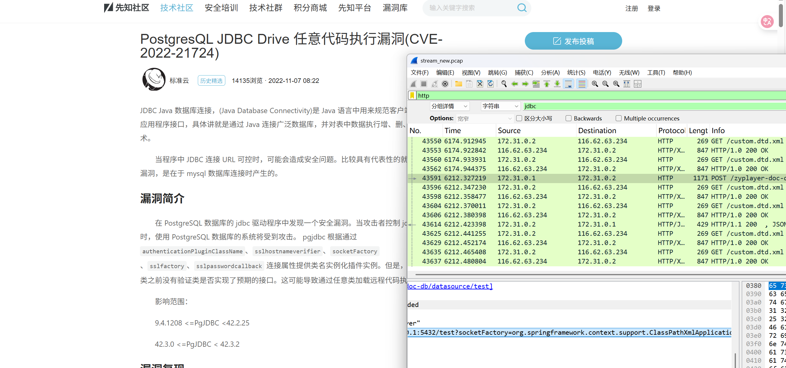

# 陇剑杯2023-ez_wiki

## 第一问：获取爆破成功的 Wiki 登录账号密码

**分析思路：** 攻击者通常会尝试多个账号密码组合进行爆破，成功登录时服务器的响应会有所不同。我们可以先找到失败的登录尝试，再根据成功的响应特征来定位正确的账号密码。

1.  **过滤 HTTP 流量并查找登录失败特征：**
    打开文件，使用显示过滤器 `http` 过滤出 HTTP 流量。观察登录请求的响应，发现登录失败时，响应包中包含 JSON 数据。
    

2.  **过滤成功的登录响应并追踪流：**
    根据登录成功的特征，修改过滤器，或者直接查找返回 200 OK 且路径为登录接口的 POST 请求。找到成功的登录请求后，右键点击该请求 -> 追踪流 -> HTTP 流。获得账号密码。
    

## 第二问：找到攻击者用于越权漏洞的 Cookie

**分析思路：** 越权漏洞通常发生在用户尝试访问或修改不属于自己的资源时。在 Cookie 中，经常会有一个字段标识当前用户（如 `userid`、`uid` 等）。攻击者可能会修改这个值来冒充其他用户（通常是管理员）。我们需要找到 Cookie 值被修改并成功访问了其他用户（如管理员）资源的请求。

1.  **过滤包含 Cookie 的 HTTP 请求：**
    使用显示过滤器 `http.cookie` 过滤出所有包含 Cookie 的 HTTP 请求。
    

2.  **检查 Cookie 内容变化：**
    逐个检查过滤出的请求中的 Cookie 值。特别关注那些可能包含用户身份标识的字段。在本例中，可以观察到 `userid` 字段。比较不同请求中的 `userid` 值。
    在数据包编号 `42530` 处，发现请求头中的 Cookie 包含 `userid=1`。这表明攻击者修改了 Cookie 中的 `userid`，试图冒充 ID 为 1 的用户。
    

## 第三问：获取通过 JDBC 漏洞读取到的数据库账号密码

**分析思路：** JDBC (Java Database Connectivity) 相关漏洞，特别是反序列化或不当的连接串处理，可能允许攻击者读取敏感文件或执行命令。攻击者可能会利用此漏洞读取数据库配置文件。

1.  **研究 JDBC 相关漏洞利用特征：**
    了解常见的 JDBC 漏洞利用方式，例如通过构造恶意的 JDBC URL 来触发 JNDI 注入、XXE 或读取本地文件。payload 中通常会包含 `jdbc:` 协议头和特定数据库驱动相关的类名或参数。
    

2.  **过滤相关流量并追踪流：**
    根据漏洞特征，在 Wireshark 中使用过滤器查找包含 `jdbc:` 关键字或特定漏洞利用模式的流量。
    找到相关的请求后，追踪其 TCP 流。在流中仔细查找响应内容或后续请求，寻找数据库配置文件的内容，其中通常包含账号和密码。
    

## 第四问：识别攻击者用于执行系统命令的 CVE 漏洞

**分析思路：** 攻击者在获得一定权限后，可能会利用其他漏洞来执行系统命令以获取更高权限或进行更深入的渗透。这通常涉及上传或触发特定文件（如 XML、配置文件等）来利用已知漏洞。

1.  **查找异常文件操作或请求：**
    在流量中寻找可疑的文件上传、下载或请求。注意到有对 `custom.dtd.xml` 文件的请求或操作，这类文件通常与 XXE (XML External Entity) 漏洞相关。
    

2.  **分析相关 Payload 并搜索 CVE：**
    追踪与 `custom.dtd.xml` 相关的 TCP 流。在流中找到具体的请求内容或文件内容，分析其 Payload 结构。将 Payload 的关键部分或特征在网上搜索。
    通过搜索 Payload 特征，发现其利用方式与 Confluence 的某个已知漏洞匹配，该漏洞允许未经身份验证的远程代码执行。
    

## 第五问：确定攻击者下载到服务器上的工具名称

**分析思路：** 在通过漏洞获得系统命令执行权限后，攻击者通常会下载后续的工具（如扫描器、后门等）到目标服务器上，以便进行内网扫描或持久化控制。我们需要在命令执行的流量中寻找下载命令和下载的文件名。

1.  **继续追踪命令执行流量：**
    继续分析漏洞利用相关的 TCP 流，特别是那些包含命令执行指令和回显的部分。
    查找常见的下载命令，如 `wget`、`curl` 等，以及它们下载的文件名。
    
    在追踪到的流中，可以发现攻击者执行了下载命令，下载的文件命名为 `fscan`。