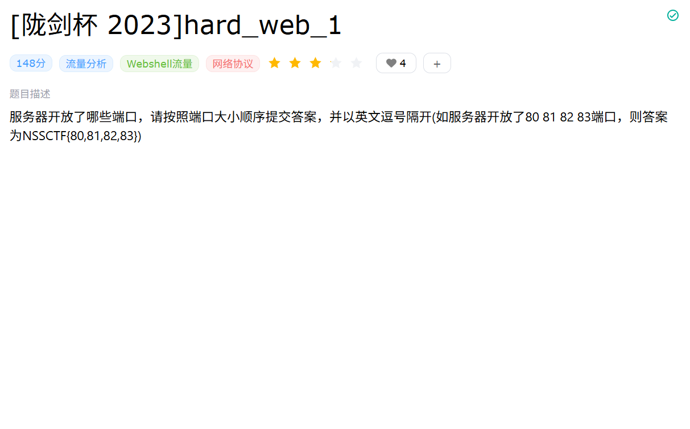
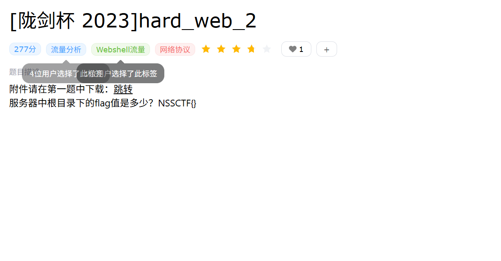
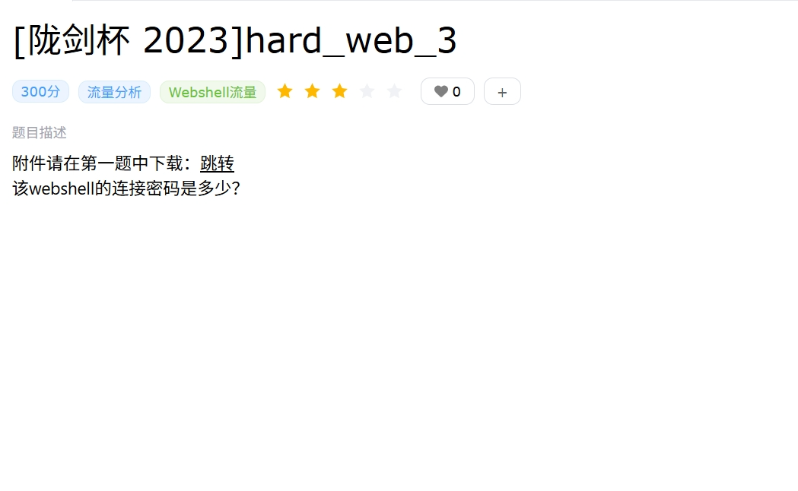
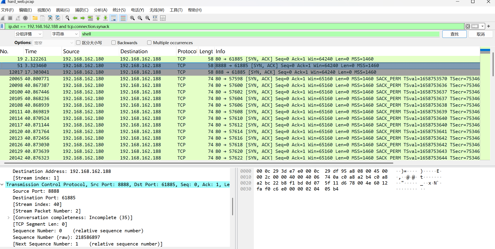
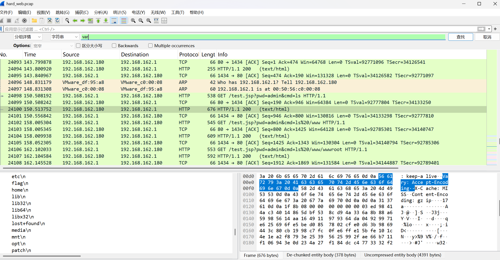
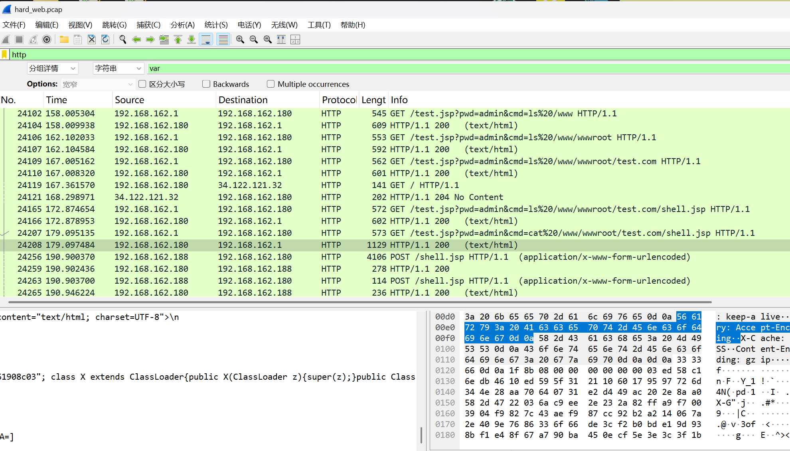
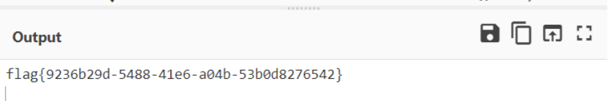
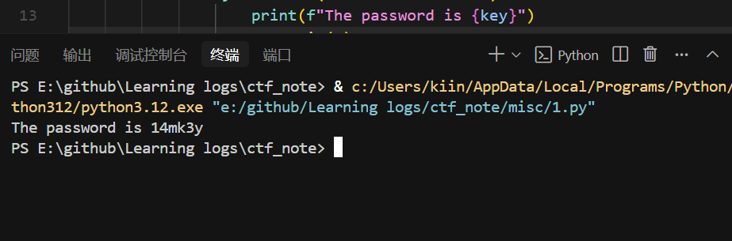

# 陇剑杯2023 - hard_web Writeup

## 1. 题目描述与初步分析

首先，分析题目要求和提供的 `.pcap` 流量包。

*   **题目要求:** 根据描述，需要分析流量包，找出服务器开放的端口、获取根目录下的 flag，并找到 Webshell 的连接密码。
    
    
    
*   **初步流量观察:**
    *   使用 Wireshark 打开 `pcap` 文件。
    *   通过观察数据包数量和 IP 地址，可以快速确定主要的通信发生在 `192.168.162.188` (客户端) 和 `192.168.162.180` (服务器) 之间。

## 2. 端口扫描与服务识别

根据题目要求，需要确定服务器 `192.168.162.180` 开放了哪些端口。

*   **分析方法:** 在网络流量中，当客户端尝试连接服务器端口时，如果端口开放，服务器会回应带有 `SYN` 和 `ACK` 标志位的 TCP 包。因此，可以过滤从服务器 (`192.168.162.180`) 发往客户端 (`192.168.162.188`) 且同时设置了 `SYN` 和 `ACK` 标志的数据包。
*   **结果:** 过滤结果显示服务器在 `88`、`888`、`8888` 端口上响应了连接请求，表明这些端口是开放的。
    

## 3. Flag 获取

接下来，寻找位于服务器根目录下的 flag。

*   **分析方法:** 需要在 HTTP 流量中查找与文件系统交互，特别是读取根目录下文件的请求。可以通过在 Wireshark 的 "分组详情" (Packet Details) 或使用 "字符串查找" 功能搜索关键词，如 "var"、"flag"、"ls /" 等。
*   **关键发现:**
    *   在流量中追踪 HTTP 请求和响应，发现存在一个 `jspshell` 的交互流量。
    *   通过代码能够确定加密方式为 **AES ECB** 模式。使用的密钥：`748007e861908c03`。
*   **解密与 Flag 定位:**
    *   使用获取到的 AES 密钥和 ECB 模式，对 `jspshell` 相关的数据包载荷进行解密。
    *   在解密后的明文数据中，可以找到执行查看根目录或直接读取 flag 文件的命令及其回显，从而获得 Flag。
    
    
    

## 4. Webshell 密码破解

最后一步是找出 `jspshell` 的连接密码。

*   **分析方法:** 继续解密 `jspshell` 的通信流量包。
*   **线索发现:** 在某个解密后的数据包中，发现了密码相关的提示信息，形式为 `1****y`。这表明密码以 '1' 开头，以 'y' 结尾，中间有 4 个未知字符。
*   **Webshell 类型识别与密码机制:**
    *   根据经验和流量特征，判断该 `jspshell` 很可能是 **哥斯拉 (Godzilla)** Webshell。
    *   哥斯拉 Webshell 的一个特点是，其通信流量使用的 AES 密钥通常是连接密码的 MD5 哈希值的前 16 位或后 16 位。在本例中，`748007e861908c03` 就是这个 16 位的值。
*   **密码破解:**
    *   已知密码格式为 `1****y`，且其 MD5 哈希的 16 位是 `748007e861908c03`。
    *   可以通过编写脚本，暴力破解中间 4 位未知字符（数字和字母组合）。对每个生成的候选密码计算 MD5 哈希，取其对应 16 位与已知的 `748007e861908c03` 进行比较。
    *   **结果:** 通过暴力破解，最终确定连接密码为 `14mk3y`。
    