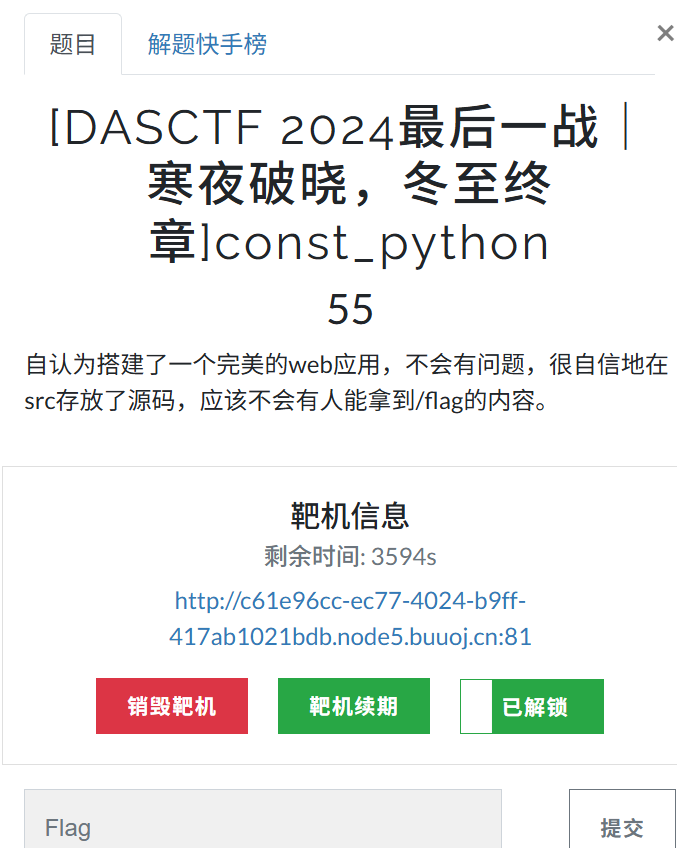
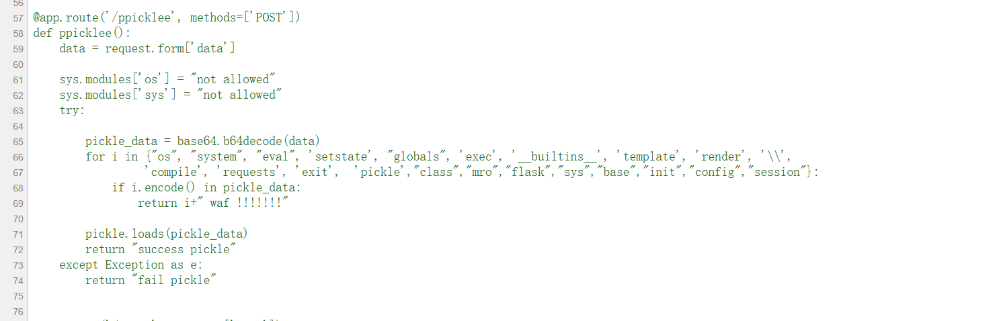
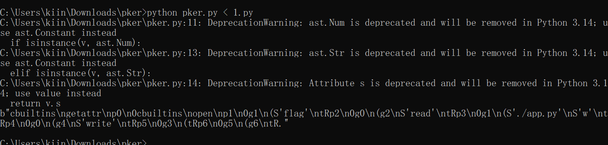
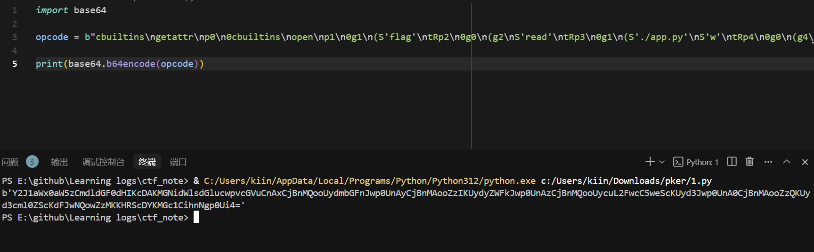
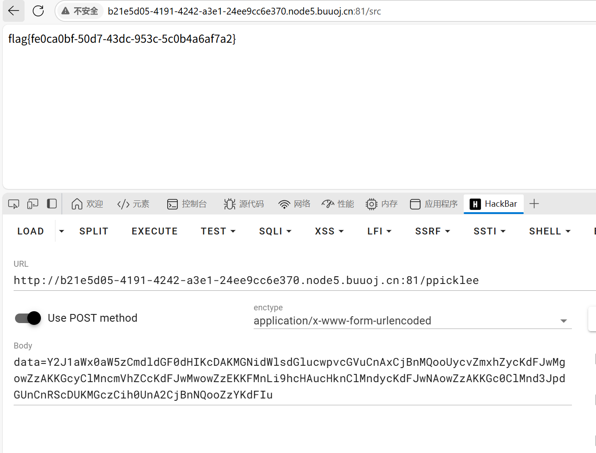

# const_python

### 1.白盒审计的python题目

### 2.访问/src查看源码，找到关键函数，可以看到要打python pickle，但禁止了一大堆函数，使用pker构造操作码
<a href="https://h4cking2thegate.github.io/posts/38618/index.html">pker使用说明</a>

### 3.根据题目说明，flag在根目录下，因此直接读取flag覆盖掉app.py即可

### 4.获得flag
