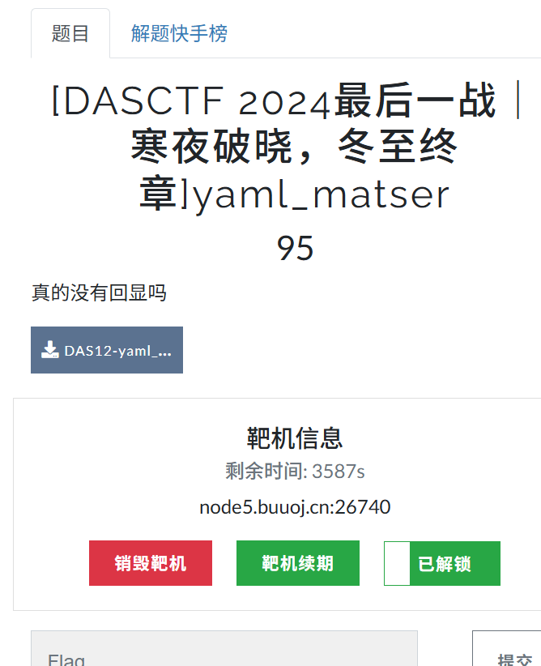
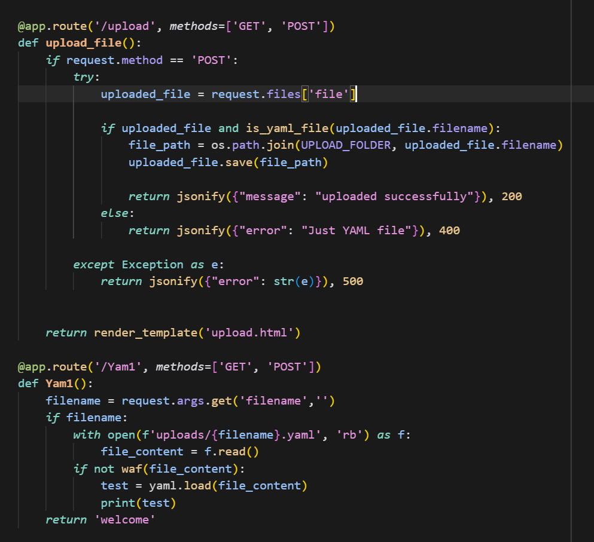
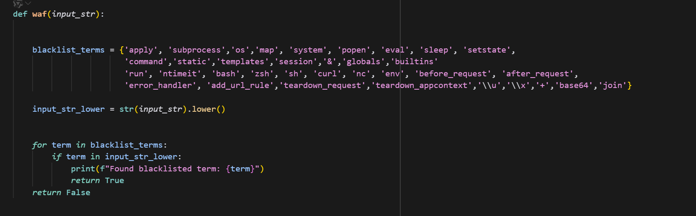
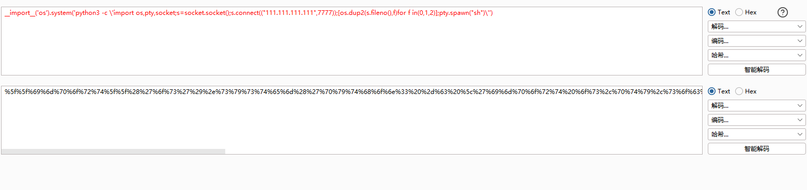
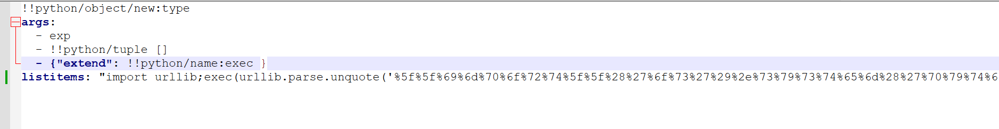
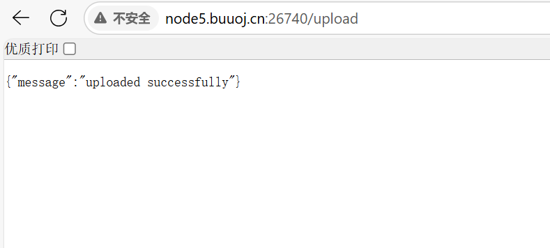
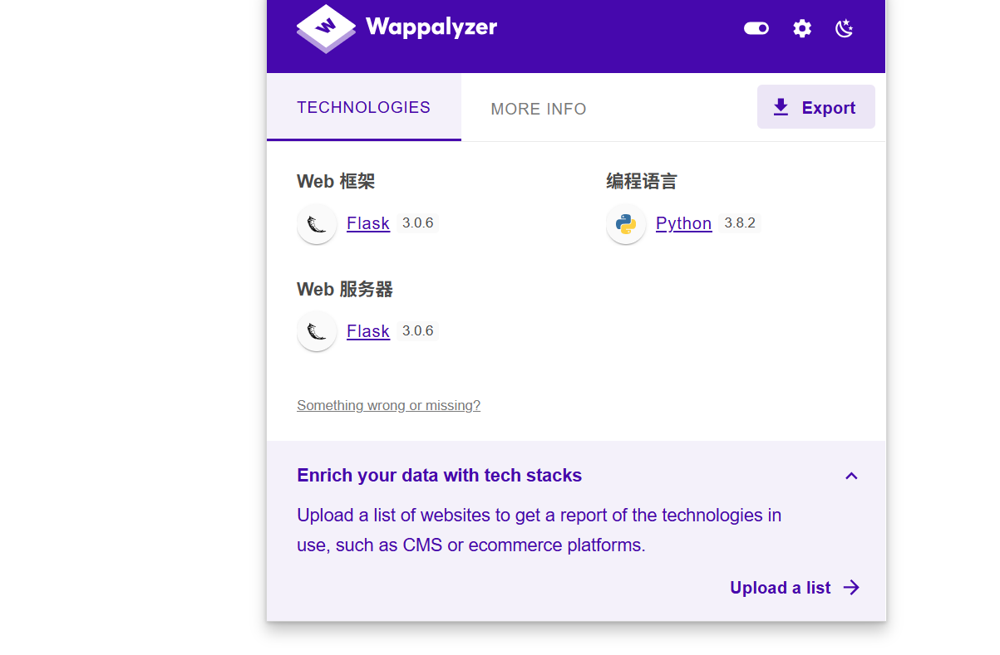
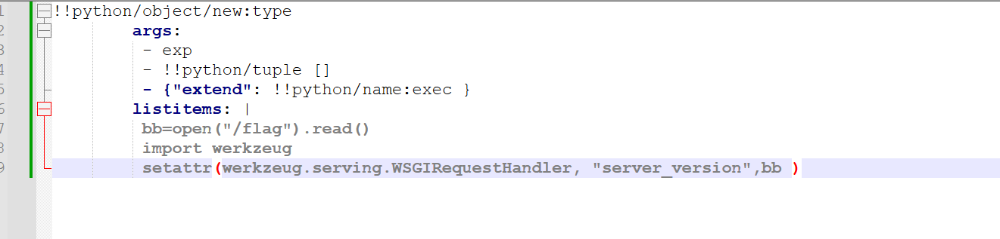
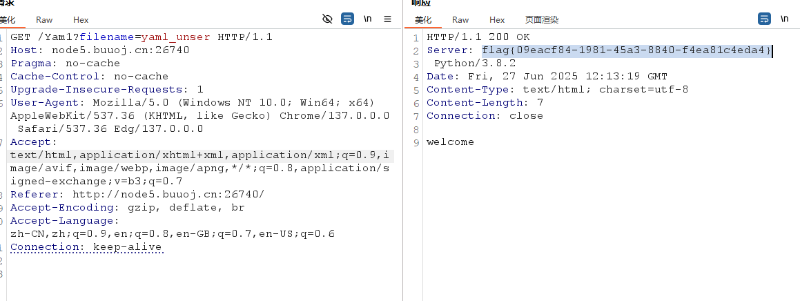

# const_python

### 1.白盒审计的python题目，直接标明了yaml，多半是yaml反序列化

<a href="https://www.tr0y.wang/2022/06/06/SecMap-unserialize-pyyaml/">pyyaml反序列化解释</a>

### 2.看代码，直接用的是yaml.load，代表版本5.1之前，有上传yaml文件的上传点。waf禁用了绝大部分命令执行函数，但有很多方式可以绕过

### 3.构造payload，url编码，反弹shell，但后面发现没有效果，使用curl外带也一样，命令成功执行却没有成功连接，靶机应该是不出网

### 4.靶机是flask框架，该框架有一个核心依赖模块werkzeug库，可以用来处理HTTP请求和响应，因此可以利用python的反射机制，使用setattr函数动态修改HTTP响应，将数据通过响应头外带，获得flag

