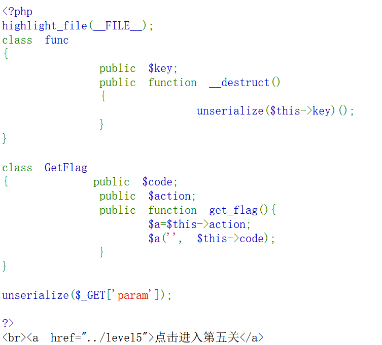
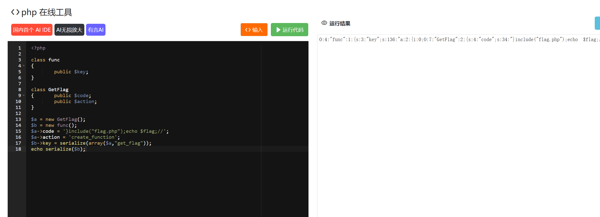

## Level 1 - `create_function` 与可变函数的调用

**代码分析:**

观察代码可以得知，`func` 类的析构函数会反序列化自身的 `key` 属性，并将其当作一个可调用（callable）对象来执行。`GetFlag` 类的 `get_flag` 方法会把自身的 `action` 属性也当作一个可调用对象来执行。

**核心知识点:**

1.  **`create_function($args, $code)`:** 这是 PHP 的一个函数，用于动态地创建一个匿名函数（闭包）。第一个参数 `$args` 定义函数的参数列表（字符串形式），第二个参数 `$code` 是函数的代码体（字符串形式）。*（注意：此函数在 PHP 7.2.0 中被弃用，并在 PHP 8.0.0 中被移除，存在严重安全风险）。*
2.  **PHP 中的可调用对象 (Callable):** 在 PHP 中，可以用多种形式表示一个可被调用的单元：
      * 函数名的字符串，例如 `"system"`。
      * 数组形式 `[对象实例, '方法名字符串']`，例如 `[$object, 'methodName']`。
      * 数组形式 `['类名字符串', '静态方法名字符串']`，例如 `['ClassName', 'staticMethod']`。
      * 实现了 `__invoke()` 魔术方法的对象实例。
      * 匿名函数（`Closure` 类的实例）。

**解题思路:**

理解了以上知识点后，解题步骤如下：

1.  **构造对象:** 创建 `GetFlag` 类和 `func` 类的实例（假设实例分别为 `$a` 和 `$f`）。
2.  **设置 `GetFlag` 的 `code` 属性:**
      * 赋值为：`'}include("flag.php");echo $flag;//'`。
      * **解释:**
          * 开头的 `}` 是为了闭合 `create_function` 默认在代码体外部添加的 `{`。这样，`include` 及后续代码就能脱离 `create_function` 创建的匿名函数的局部作用域，成为全局代码，从而能够访问全局变量 `$flag` 或执行 `include`。
          * 末尾的 `//` 用于注释掉 `create_function` 可能在代码体后追加的 `}` 或其他代码，防止语法错误或干扰。
3.  **设置 `GetFlag` 的 `action` 属性:**
      * 赋值为字符串：`"create_function"`。
      * **解释:** 虽然 `"create_function"` 本身是一个字符串，但根据 PHP 的可调用对象规则，当 `$a->action` 被当作函数调用时 (`($this->action)($this->code)` in `get_flag` method)，PHP 会将其识别为函数名并执行 `create_function` 函数。它会使用 `$this->code`（即我们构造的代码字符串）作为参数，动态创建一个函数并返回其内部名称（但由于我们注入的代码，实际执行的是 `include` 等）。
4.  **设置 `func` 的 `key` 属性:**
      * 赋值为一个数组：`[$a, "get_flag"]` (这里 `$a` 是 `GetFlag` 的实例)。
      * **解释:** 根据 PHP 的可调用对象规则，当 `$f->key` 在 `func` 的析构函数中被当作函数调用时 (`($this->key)();`)，PHP 会识别这是一个对象方法调用。它会自动调用数组的第一个元素 `$a` 作为对象实例，第二个元素 `"get_flag"` 作为要调用的方法名，从而执行 `$a->get_flag()`。

**执行流程:**

当 `$f` 对象销毁（例如脚本结束时）触发其析构函数 `__destruct` -\> `$this->key` (即 `[$a, "get_flag"]`) 被调用 -\> 执行 `$a->get_flag()` -\> `$this->action` (即 `"create_function"`) 被调用 -\> 执行 `create_function($this->code)` -\> 由于注入的 `}` 和 `//`，实际执行了 `include("flag.php"); echo $flag;` -\> 成功获取 flag。

**相关图片:**




-----

## Level 2 - just\_one\_soap (利用 SoapClient 进行 SSRF)

**核心原理:**

PHP 的 `SoapClient` 类可以用于向指定的 `location` 发送 HTTP (SOAP) 请求。关键在于，当你调用 `SoapClient` 对象的**任意方法**（即使该方法在类中并不存在）时，PHP 会尝试将这个方法调用解释为一个 SOAP 操作，并据此触发一个到底层 `location` URL 的 HTTP 请求。

**题目场景:**

在题目 `index.php` 中调用了 `$c->daydream()`。如果变量 `$c` 是 `SoapClient` 类的一个实例，那么当 `$c->daydream()` 被执行时，`daydream` 会被视为一个 SOAP 方法名，从而触发 `SoapClient` 向其配置的 `location` 发起 HTTP 请求。这可以被用来进行服务端请求伪造 (SSRF)。

**构造 Payload 实现 SSRF:**

目标是构造一个 `SoapClient` 实例，使其发出的 HTTP 请求能够满足 `flag.php` 的验证条件（例如，特定的 User-Agent、Content-Type、POST 数据等）。

```php
<?php
// 需要发送的 POST 数据体
$post_data = 'pass=password';
// 计算 POST 数据体的长度
$data_len = strlen($post_data);

// 构造 User-Agent，利用 \r\n 注入额外的 HTTP 头部
// 这里注入了 Content-Type 和 Content-Length 头，以及 POST 数据体
$user_agent = "admin\r\nContent-Type: application/x-www-form-urlencoded\r\nContent-Length: $data_len\r\n\r\n$post_data";

// 创建 SoapClient 实例
$a = new SoapClient(null, [ // 第一个参数 WSDL 设置为 null
    'location'   => 'http://<target_server>/SER/level10/flag.php', // 目标 URL
    'user_agent' => $user_agent, // 设置包含注入头部的 User-Agent
    'uri'        => 'bbba' // targetNamespace，可以任意设置，对 SSRF 不重要
]);

// 序列化构造好的 SoapClient 对象
$b = serialize($a);
// URL 编码序列化后的字符串，以便通过 GET/POST 参数传递
echo urlencode($b);
?>
```

**关键选项:**

  * `location`: 指定 SOAP 请求的目标 URL。
  * `user_agent`: 允许自定义 HTTP 请求的 `User-Agent` 头。利用这个选项和 `\r\n` (CRLF)，可以注入任意其他的 HTTP 头部，甚至是在某些情况下注入请求体（如上例所示，通过两个 `\r\n` 分隔头部和主体）。
  * `uri`: 指定 SOAP 消息的 `targetNamespace`。

通过将 `urlencode($b)` 的结果提交给目标应用的某个反序列化入口点（例如，作为某个参数的值），当目标代码反序列化并得到 `$c = unserialize(...)`，随后调用 `$c->daydream()` 时，就会触发一个精心构造的 HTTP 请求到 `flag.php`，从而可能获取 flag。

-----

## Level 3 - session.upload\_progress (利用文件上传机制进行反序列化)

**场景:**

当 PHP Session 的存储内容本身不可直接控制时，但服务器配置满足以下条件：

1.  `session.upload_progress.enabled` 设置为 `On` (PHP \>= 5.4 默认开启)。
2.  应用中存在反序列化 Session 数据的代码。

**核心原理:**

当 `session.upload_progress.enabled` 开启时，PHP 会在处理文件上传的**同时**，检查是否存在一个特定名称的 POST 参数（该名称由 `session.upload_progress.name` 配置项定义，默认为 `PHP_SESSION_UPLOAD_PROGRESS`）。如果这个 POST 参数存在，PHP 就会在 `$_SESSION` 中创建一个以 `session.upload_progress.prefix` (默认值) + 这个 POST 参数的**值** 组合而成的键，并在该键下存储文件上传的进度信息（包括文件名、临时文件名等）。

**漏洞利用:**

利用的关键在于：在文件上传**开始时**，PHP 会查找名为 `PHP_SESSION_UPLOAD_PROGRESS` 的 POST 变量，并将其**值**写入 Session 数据结构中（通常是作为 `$_SESSION` 数组的一个键名或键名的一部分）。如果在文件上传的**同一个请求**中，我们发送了 `PHP_SESSION_UPLOAD_PROGRESS=恶意序列化字符串` 这样的 POST 数据，那么这个恶意字符串就有可能被写入到 Session 文件中。如果之后应用程序代码读取并反序列化了该 Session 数据（例如 `unserialize($_SESSION['some_key'])`），就能触发反序列化漏洞。

**利用步骤:**

1.  **构造 Payload:** 精心构造一个包含恶意 PHP 对象的序列化字符串。
2.  **创建 HTML 表单:**
      * 包含一个文件上传字段 (`<input type="file" name="file">`)。
      * **关键:** 在同一个表单中，包含一个隐藏字段或通过 JavaScript 添加一个 POST 参数，其**名称**为 `PHP_SESSION_UPLOAD_PROGRESS`，其**值**设置为步骤 1 中构造的恶意序列化字符串。
    <!-- end list -->
    ```html
    <form action="http://target.com/upload.php" method="POST" enctype="multipart/form-data">
        <input type="hidden" name="PHP_SESSION_UPLOAD_PROGRESS" value="恶意序列化字符串在这里" />
        <input type="file" name="file" />
        <input type="submit" value="Upload" />
    </form>
    ```
3.  **发送请求 (或修改请求):**
      * 方法一：直接通过上述 HTML 页面提交表单。选择任意一个文件上传。PHP 在处理上传时会读取 `PHP_SESSION_UPLOAD_PROGRESS` 的值并写入 Session。
      * 方法二（如原笔记所述，更灵活）：
          * 使用普通的文件上传表单提交一个文件。
          * 使用代理工具（如 Burp Suite）拦截这个上传请求。
          * 在请求的 POST 数据部分，**手动添加**一个名为 `PHP_SESSION_UPLOAD_PROGRESS` 的参数，并将其值设置为你的恶意序列化字符串。
          * 发送修改后的请求。

**后续:**

一旦包含恶意序列化字符串的 Session 数据被写入，等待或触发目标应用程序中反序列化 Session 数据的代码路径，即可执行任意代码或实现其他攻击效果。